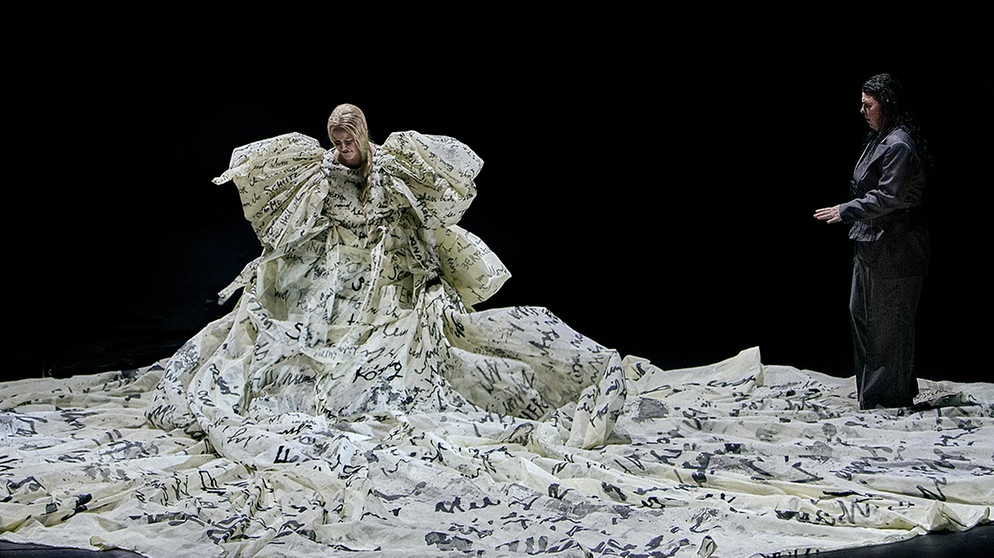
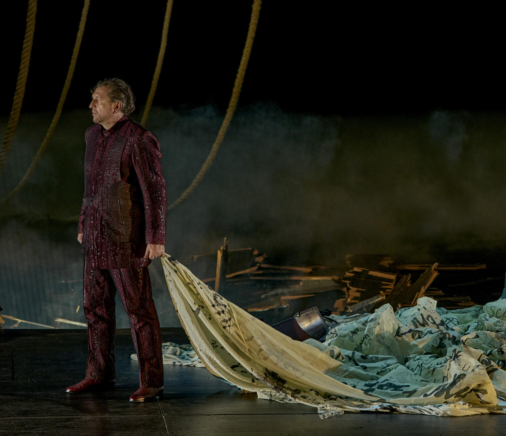

|   |  |
|:--|:--|
| Conductor | Semyon Bychkov |
| Director | Thorleifur Örn Arnarsson |
| Stage design | Vytautas Narbutas |
| Costumes | Sibylle Wallum |
| Dramaturgy | Andri Hardmeier |
| Lighting | Sascha Zauner |
| Choral Conducting | Thomas Eitler-de Lint |
| Tristan | Andreas Schager |
| Marke | Günther Groissböck |
| Isolde | Camilla Nylund |
| Kurwenal | Jordan Shanahan |
| Melot | Alexander Grassauer |
| Brangäne | Ekaterina Gubanova |
| Ein Hirt | Daniel Jenz |
| Ein Steuermann | Lawson Anderson |
| Junger Seemann | Matthew Newlin |

[Official website](https://www.bayreuther-festspiele.de/en/fsdb/productions/tristan-und-isolde/2025/15128/)

