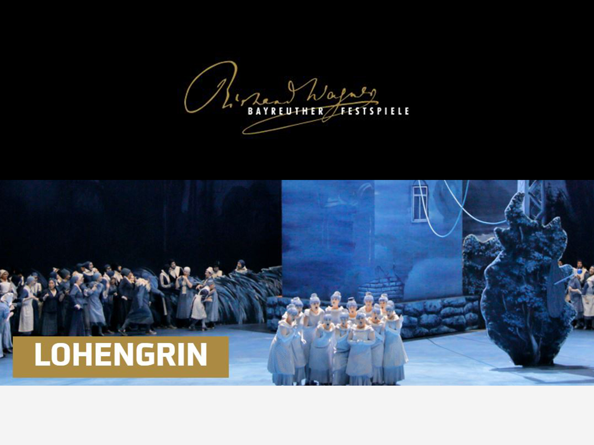
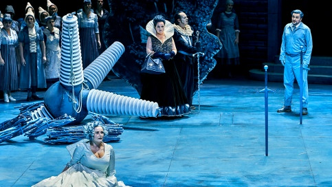
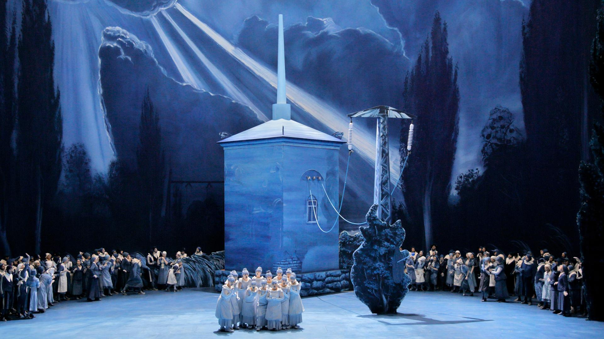
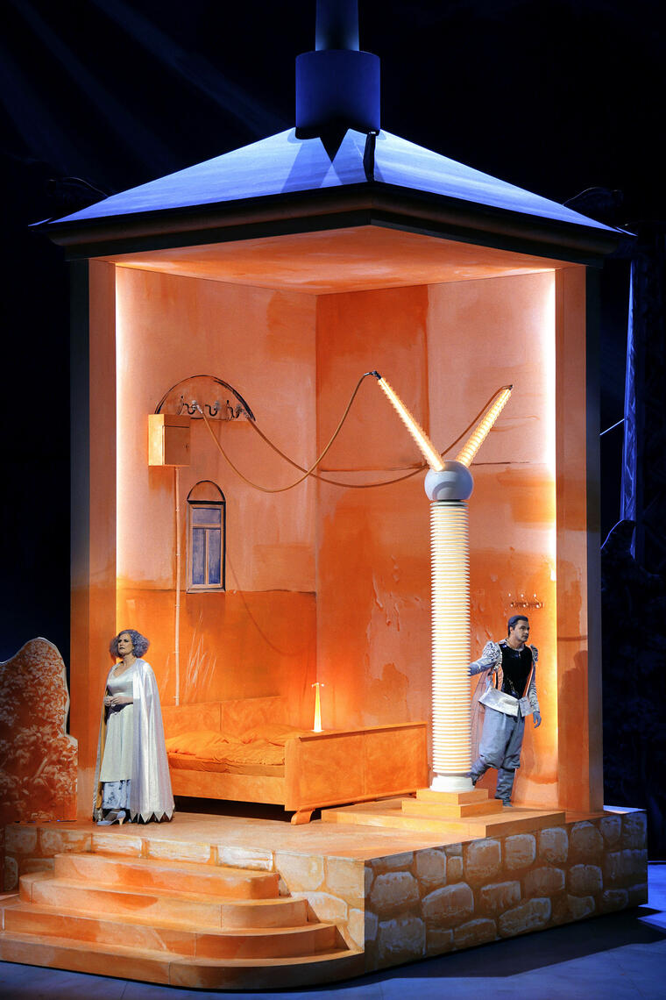

|   |  |
|:--|:--|
| Conductor | Christian Thielemann |
| Director | Yuval Sharon |
| Stage design | Rosa Loy, Neo Rauch |
| Costumes | Rosa Loy, Neo Rauch |
| Lighting | Reinhard Traub † |
| Choral Conducting | Thomas Eitler-de Lint |
| Heinrich der Vogler | Mika Kares |
| Lohengrin | Piotr Beczała |
| Elsa von Brabant | Elza van den Heever |
| Friedrich von Telramund | Olafur Sigurdarson |
| Ortrud | Miina-Liisa Värelä |
| Der Heerrufer des Königs | Michael Kupfer-Radecky |

[Official website](https://www.bayreuther-festspiele.de/en/fsdb/productions/lohengrin/2025/15127/)

