|   |  |
|:--|:--|
| Musikalische Leitung | Christian Thielemann              |
| Inszenierung, Bühne | Dmitri Tcherniakov                 |
| Szenische Einstudierung, Spielleitung | Lilli Fischer    |
| Spielleitung | José Darío Innella                        |
| Kostüme | Elena Zaytseva                                 |
| Licht | Gleb Filshtinsky                                 |
| Video | Alexey Poluboyarinov                             |
| Wotan | Michael Volle                                    |
| Donner | Roman Trekel                                    |
| Froh | Siyabonga Maqungo                                 |
| Loge | Sebastian Kohlhepp                                |
| Alberich | Jochen Schmeckenbecher                        |
| Mime | Stephan Rügamer                                   |
| Fasolt | Mika Kares                                      |
| Fafner | Peter Rose                                      |
| Fricka | Claudia Mahnke                                  |
| Freia | Sonja Herranen                                   |
| Erda | Anna Kissjudit                                    |
| Woglinde | Evelin Novak                                  |
| Wellgunde | Natalia Skrycka                              |
| Floßhilde | Ekaterina Chayka-Rubinstein                  |

Der Nibelung Alberich raubt den Rheintöchtern das Rheingold, um daraus den Ring zu schmieden, der „maßlose Macht” verleiht. Unterdessen gerät Göttervater Wotan in Zugzwang: Um die Riesen Fasolt und Fafner für den Bau der Götterburg Walhall entlohnen zu können, raubt er mithilfe des listigen Feuergotts Loge den Nibelungenschatz. Alberich verflucht den Ring und alle seine künftigen Besitzer – die Tragödie nimmt ihren Lauf.

Das Rheingold bildet das Fundament von Wagners epochaler Ring-Tetralogie, die über einen Zeitraum von rund einem Vierteljahrhundert entstand. Wesentliche Themen werden während dieses pausen- und atemlosen „Vorabends” exponiert, im Blick auf die Handlung wie auf die Musik. Aus einem tiefen Es der Kontrabässe heraus entfaltet Wagner seine eigene mythologische Welt, deren Aufstieg und Untergang mit großer Eindringlichkeit vor Augen und vor Ohren geführt werden. Es ist eine Welt der Götter, Riesen, Zwerge und Naturwesen, streng hierarchisch auf verschiedenen Ebenen beheimatet, mit mancherlei Konfliktpotential. Und obwohl das Rheingold durchaus Züge einer Fantasy-Story trägt, entwickelt sich aus dem Geschehen viel mehr: ein wahres Weltendrama von gewaltigen Ausmaßen und universeller Bedeutung, das auch unserer Gegenwart jede Menge zu sagen hat. Wagners große Familiensaga wird zum allumfassenden Epos über Macht und Liebe, Krieg und Frieden und die segens- wie verhängnisvolle Wirkung von Leidenschaften.

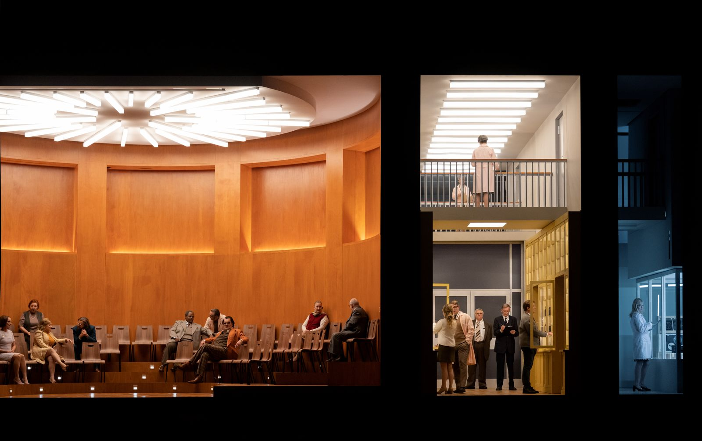
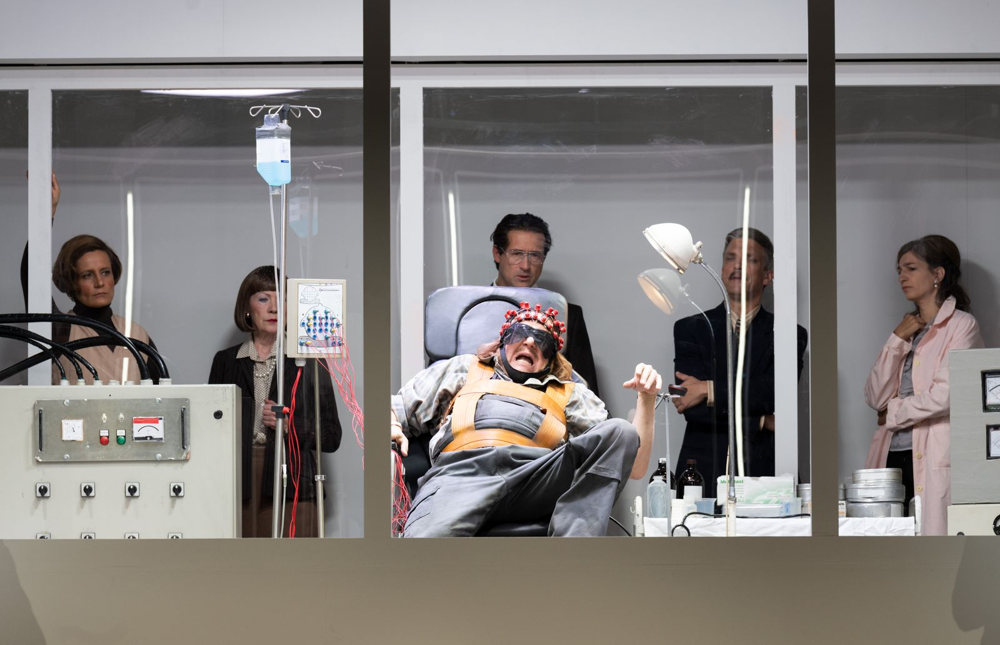
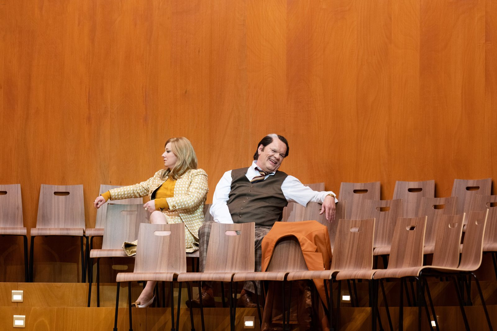
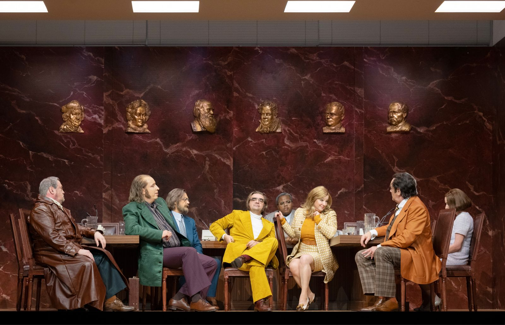
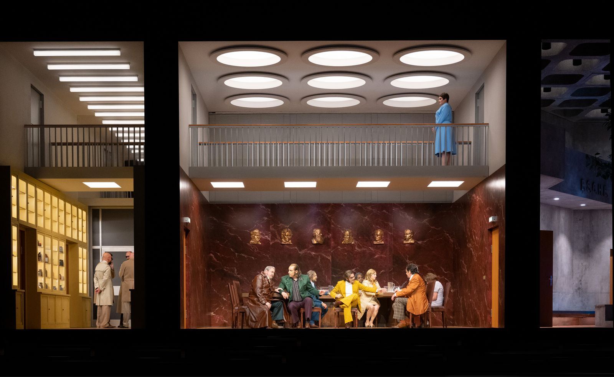
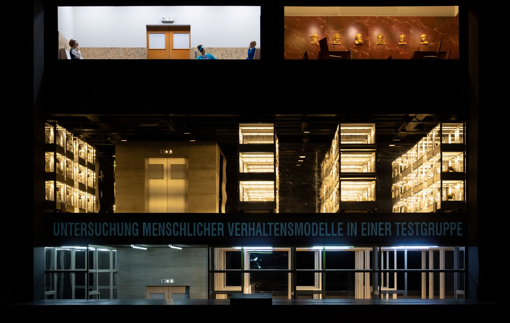
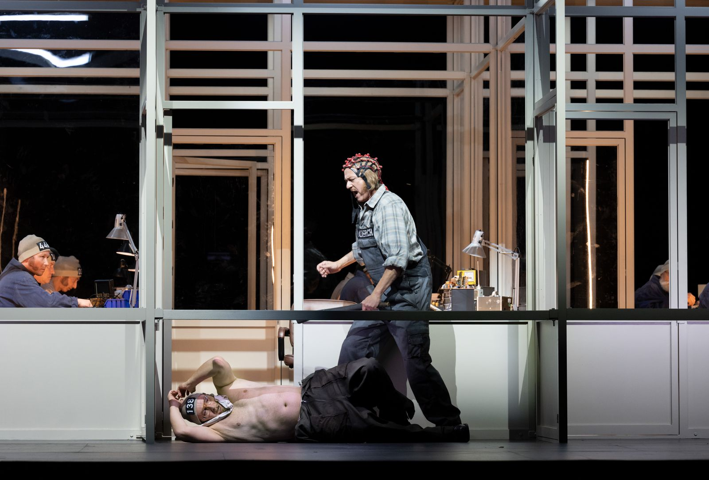
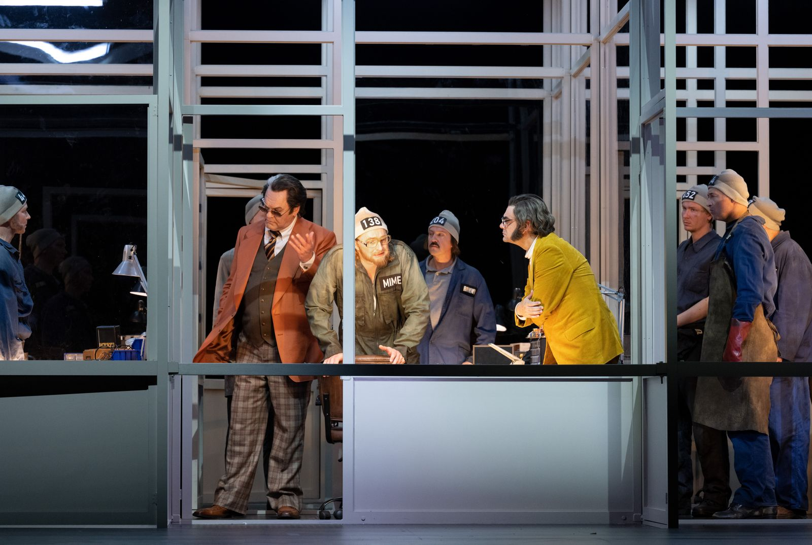
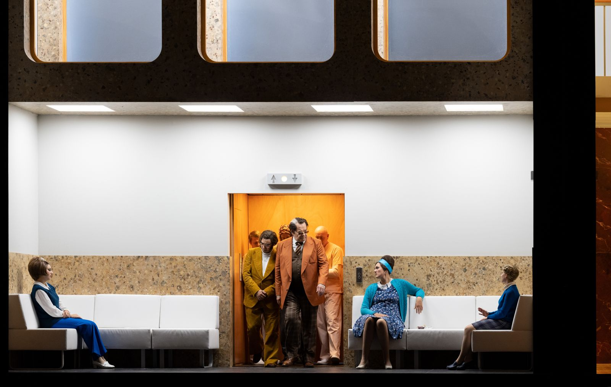
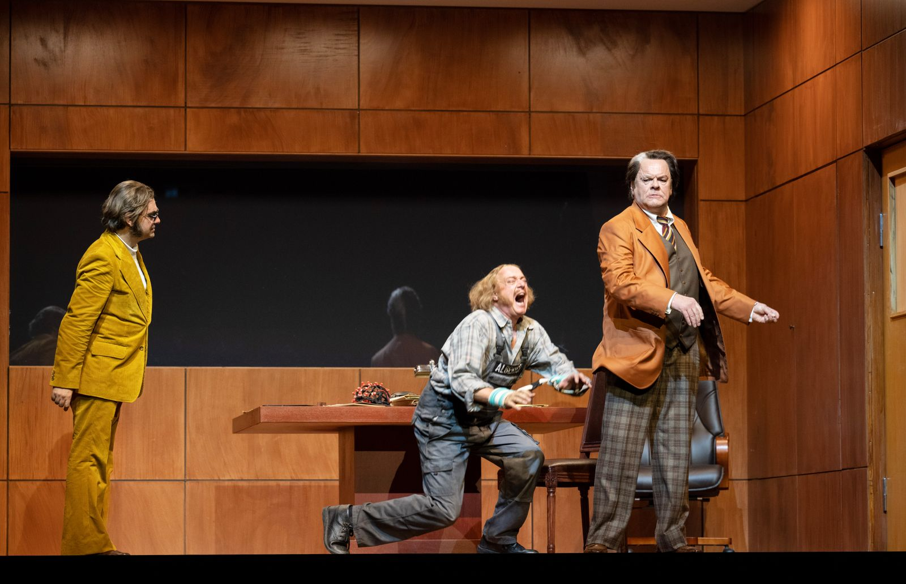
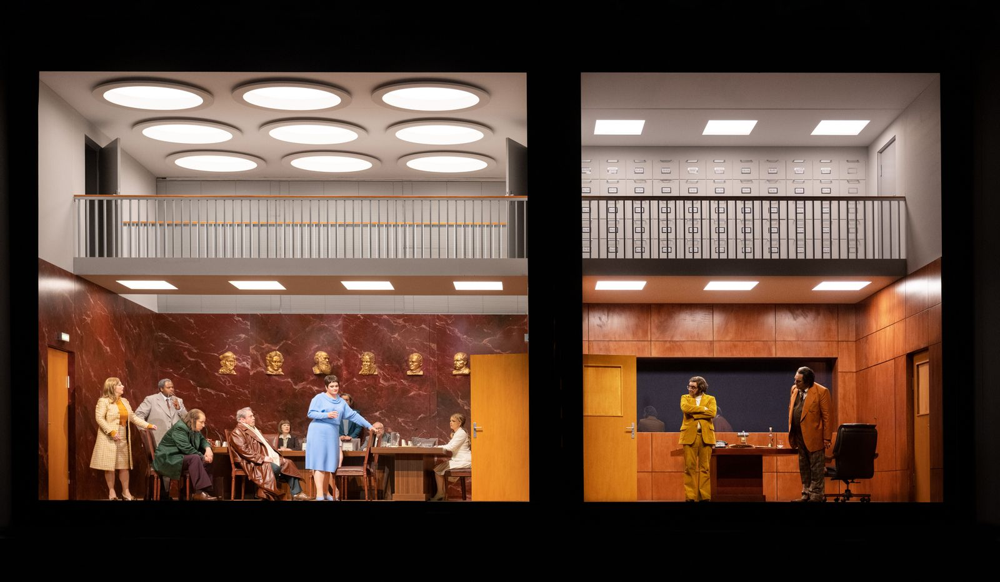
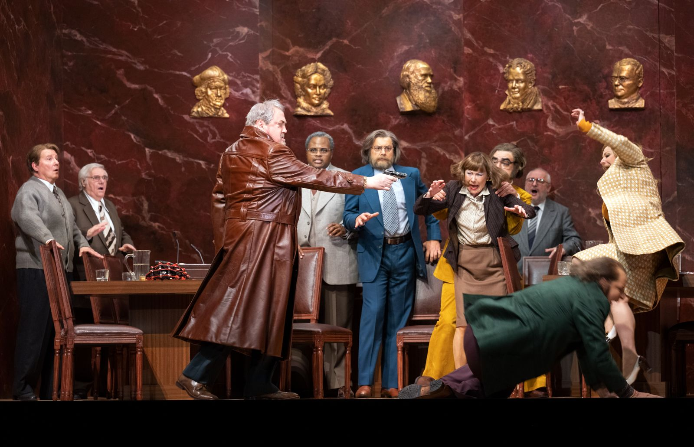
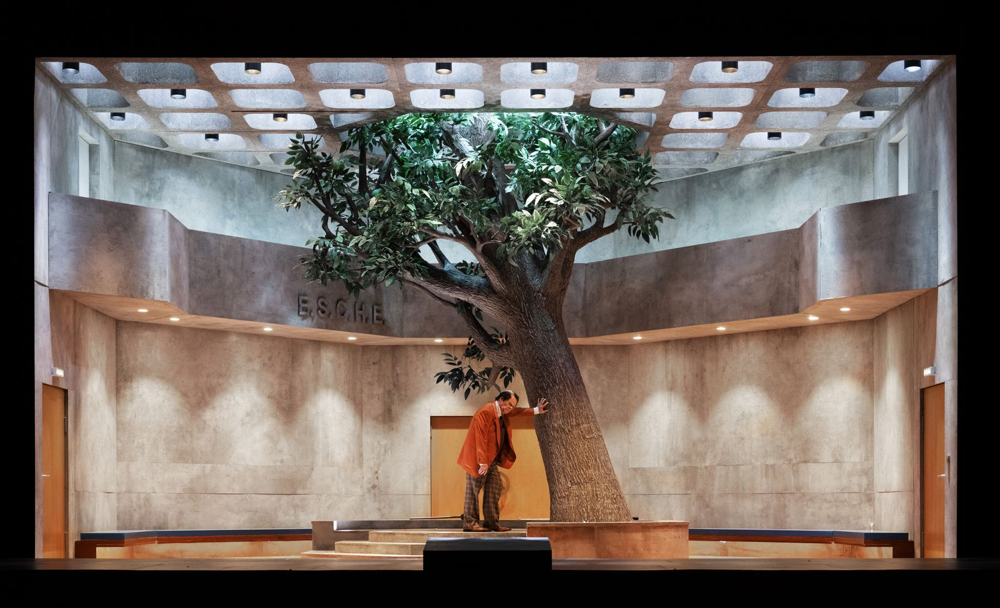
