|   |  |
|:--|:--|
| Musikalische Leitung | Christian Thielemann              |
| Inszenierung, Bühne | Dmitri Tcherniakov                 |
| Szenische Einstudierung, Spielleitung | Lilli Fischer    |
| Spielleitung | José Darío Innella                        |
| Kostüme | Elena Zaytseva                                 |
| Licht | Gleb Filshtinsky                                 |
| Video | Alexey Poluboyarinov                             |
| Siegmund | Eric Cutler                        |
| Sieglinde | Vida Miknevičiūtė  |
| Hunding | Mika Kares  |
| Wotan | Michael Volle  |
| Brünnhilde | Anja Kampe  |
| Fricka | Claudia Mahnke  |
| Gerhilde | Clara Nadeshdin  |
| Helmwige | Sonja Herranen  |
| Waltraute | Michal Doron  |
| Schwertleite | Anna Kissjudit  |
| Ortlinde | Anna Samuil  |
| Siegrune | Ekaterina Chayka-Rubinstein  |
| Grimgerde | Marina Prudenskaya  |
| Roßweiße | Kristina Stanek  |

Durch Nachkommen will Wotan seine Macht sichern. Die Zwillinge Siegmund und Sieglinde scheinen perfekt dafür. Das Schicksal führt sie eines Tages zusammen. Wotans Gemahlin Fricka ist die Geschwisterliebe jedoch ein Dorn im Auge, Wotan selbst ist innerlich zerrissen. Als seine Lieblingstochter, die Walküre Brünnhilde, gegen ihn aufbegehrt, versetzt er sie in Schlaf und legt einen Feuerkreis um sie, den nur ein Furchtloser durchschreiten kann.

Am ersten Abend des Bühnenfestspiels treten erstmals Menschen auf, Wagner setzt gewissermaßen neu mit seiner Erzählung an. Zudem kommt ein neuer Ton in die Musik, mit großer Expression und Emphase, den großen Gefühlen entsprechend, die immer mehr an Raum einnehmen. Prägend sind neben den intensiven Dialogszenen, die Wagner mit psychologischer Tiefenschärfe ausgestaltet, effektvolle instrumentale Partien wie der „Walkürenritt” und der „Feuerzauber”, die zweifellos zu den musikalischen Höhepunkten der gesamten Ring-Tetralogie zählen, mit schier überwältigender Wirkung. Mit der Walküre-Partitur, in den mittleren 1850er Jahren komponiert, erreichte Wagner eine neue Stufe seiner Kunst, dem Orchester ein besonderes Sprach- und Mitteilungsvermögen zu geben – zusätzliche Sinnschichten werden entwickelt und in das Werk eingebracht. Und nicht nur das Menschenpaar Siegmund und Sieglinde lässt ein buchstäbliches „Mitleiden” entstehen, sondern auch die göttlichen Wesen, die ebenso menschlich denken, fühlen und handeln.

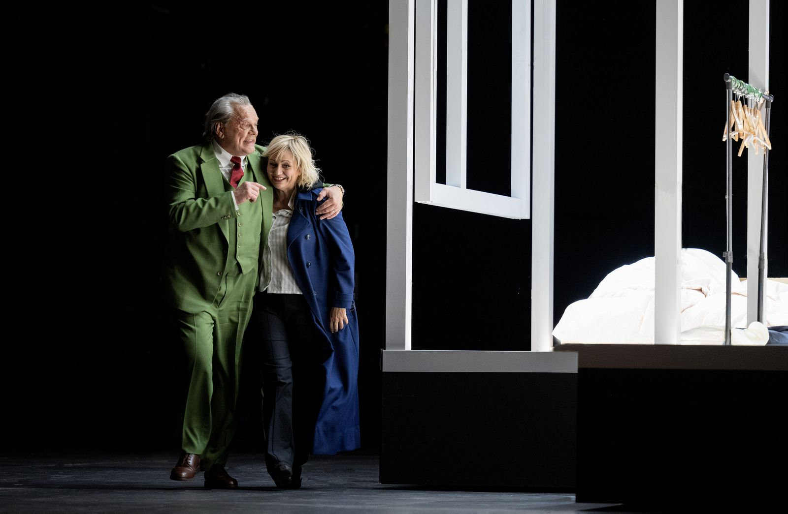
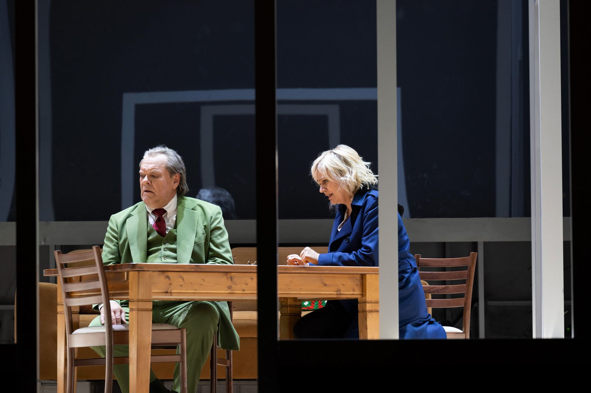
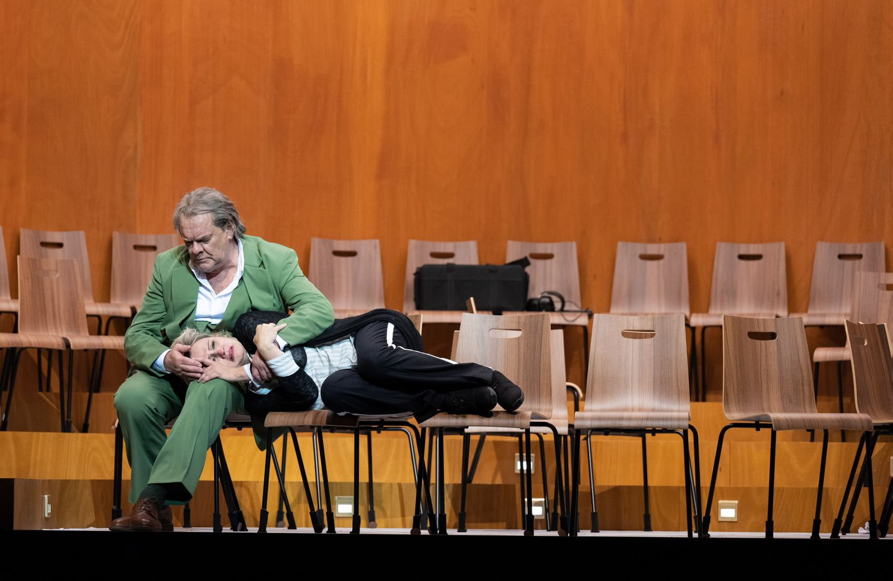
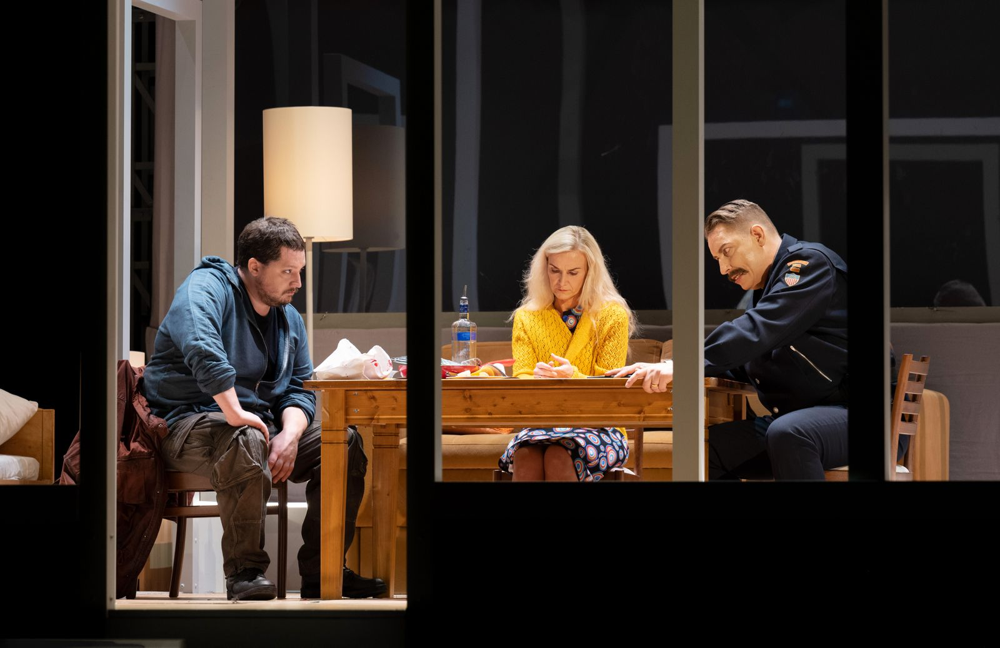
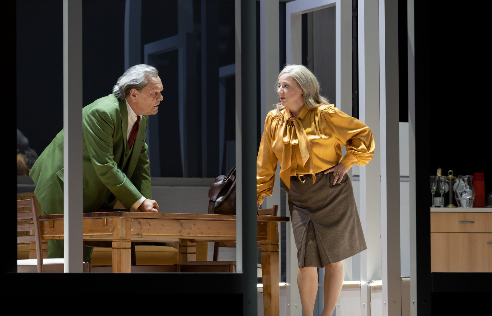
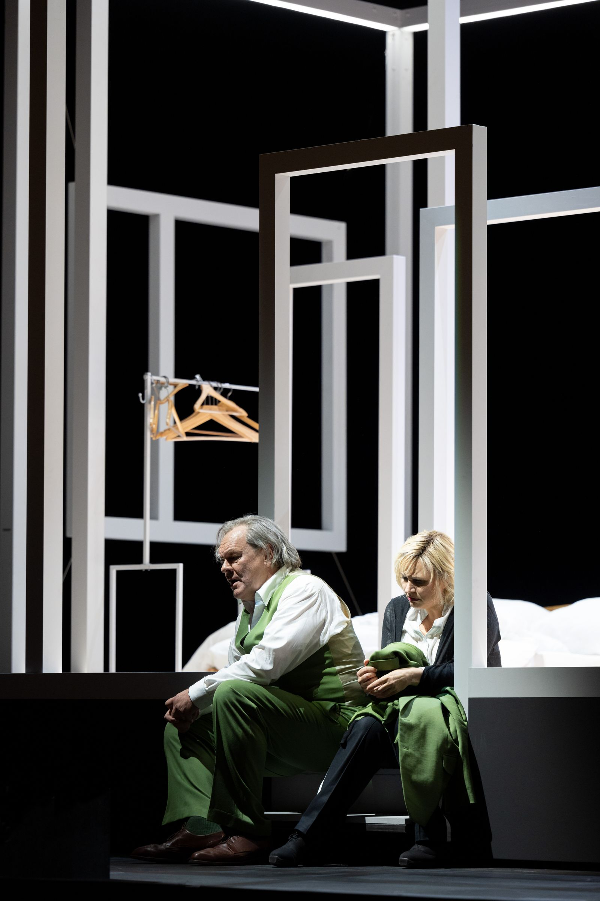
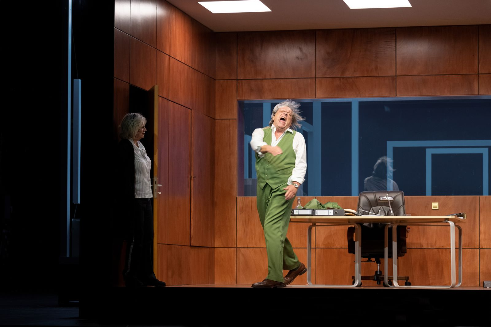
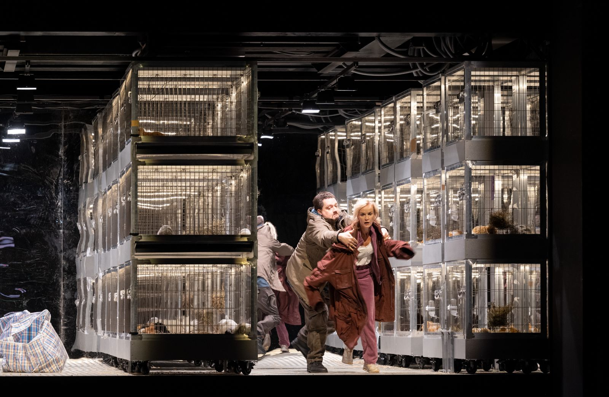
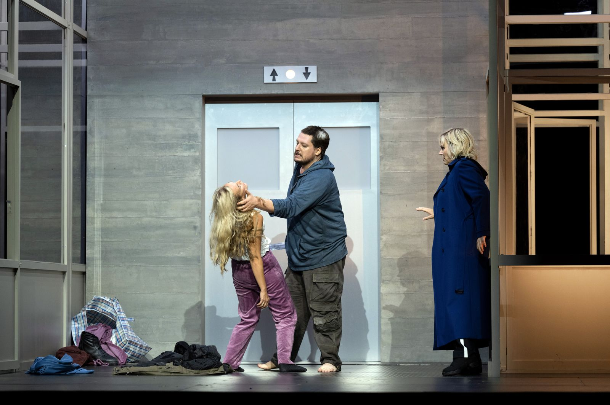
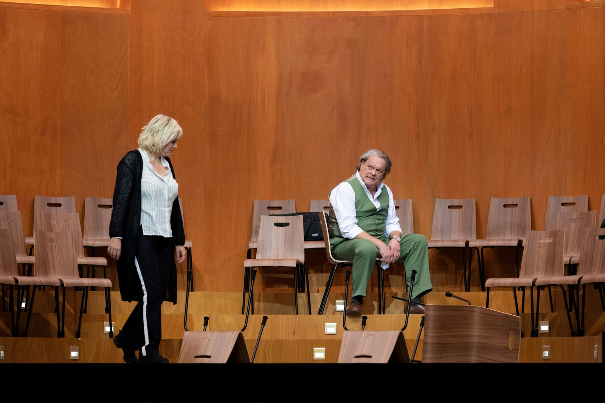
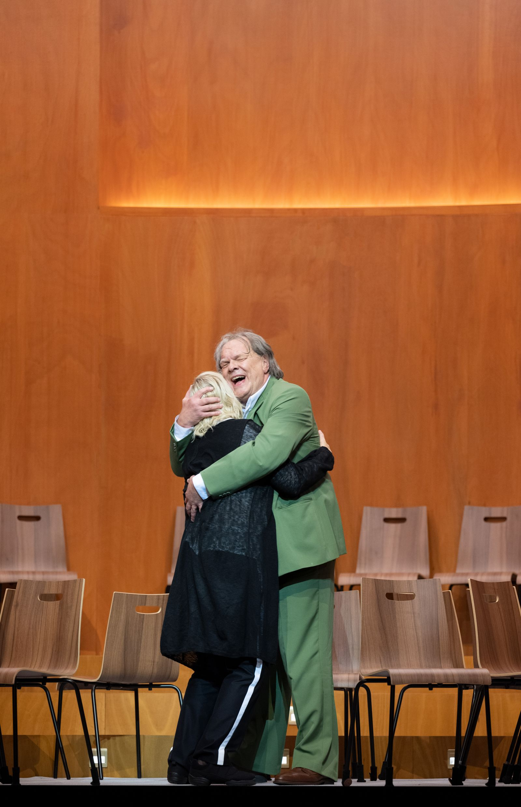
