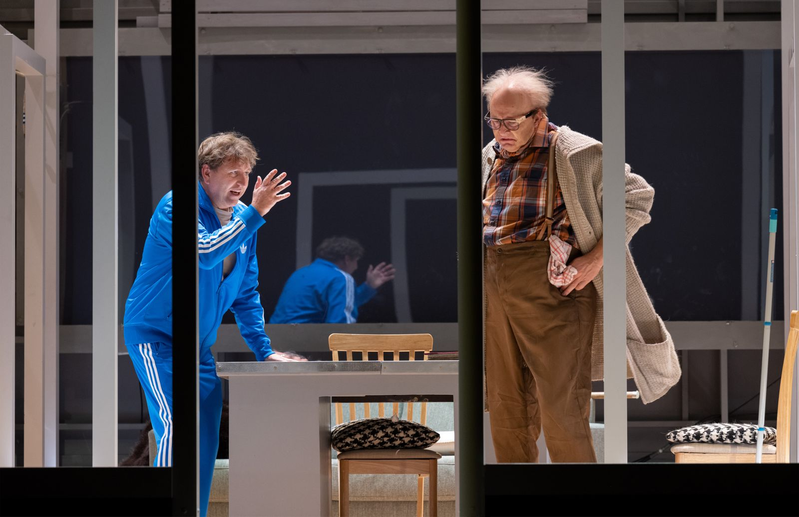
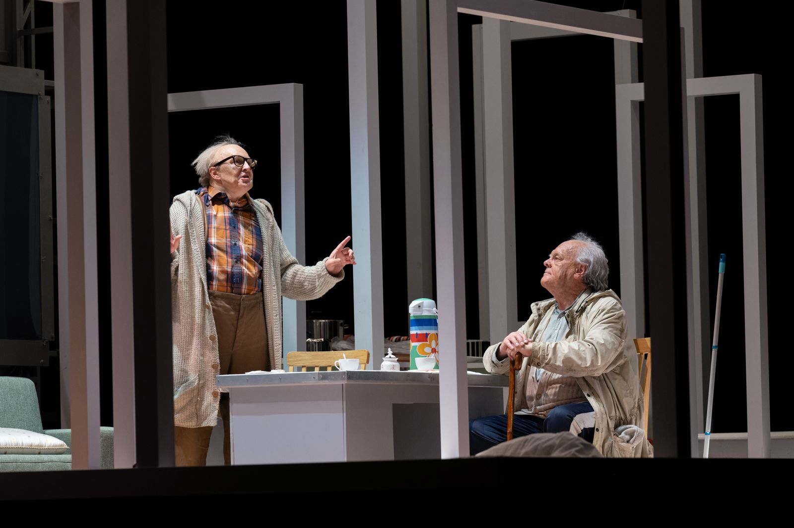
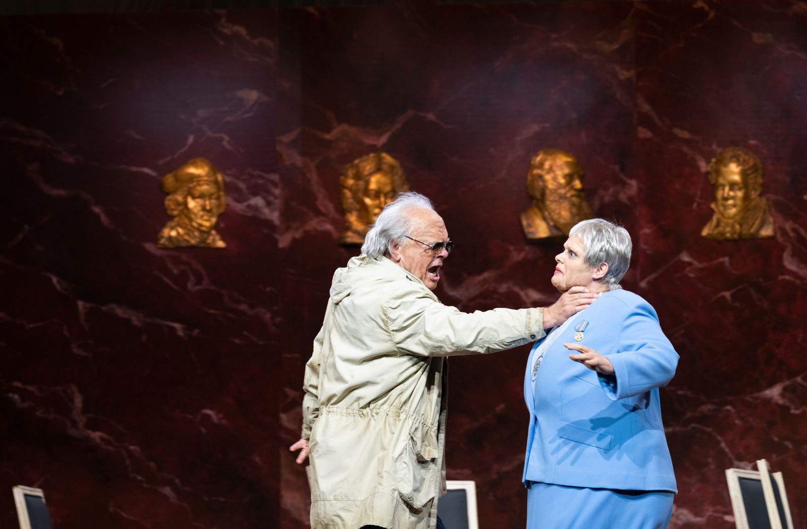
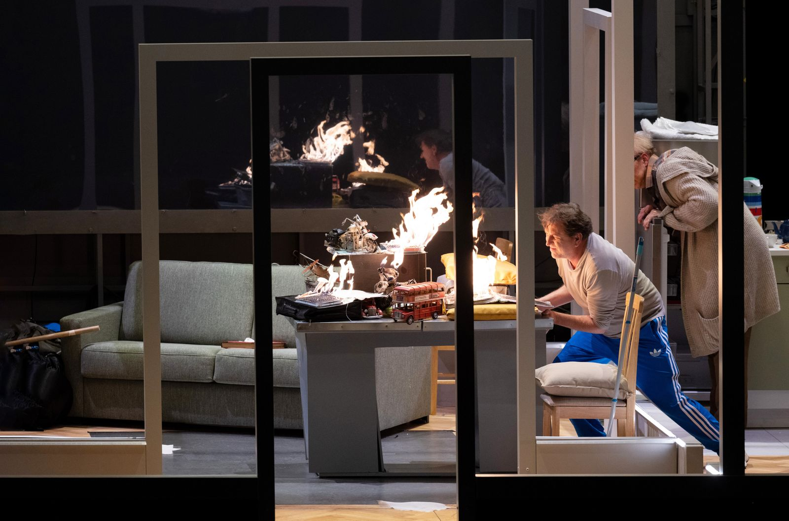
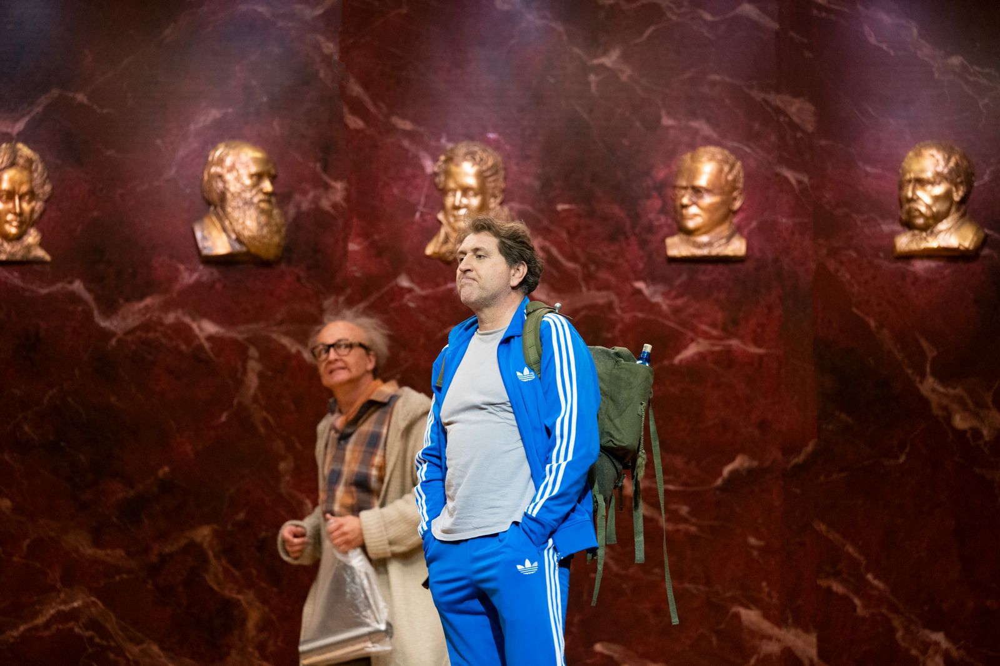
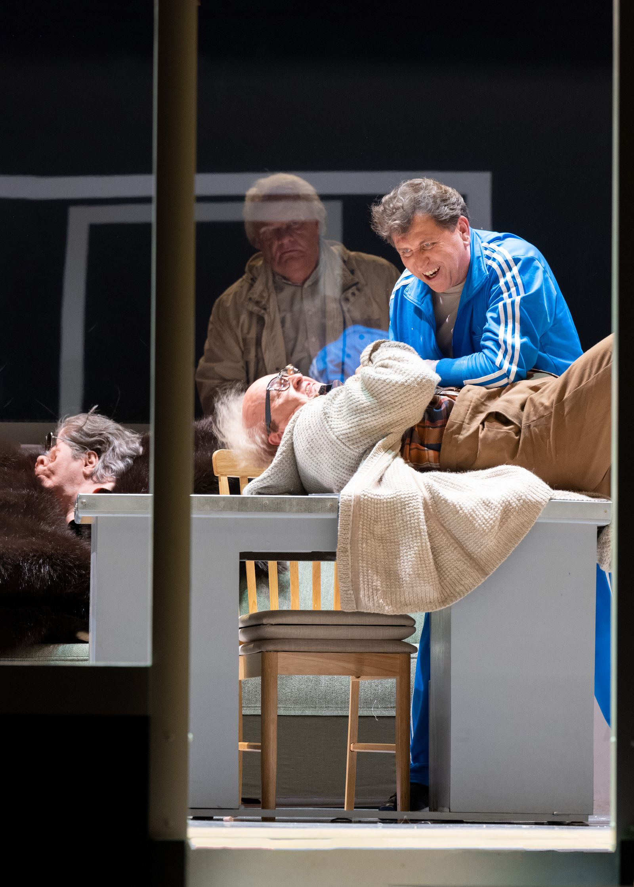
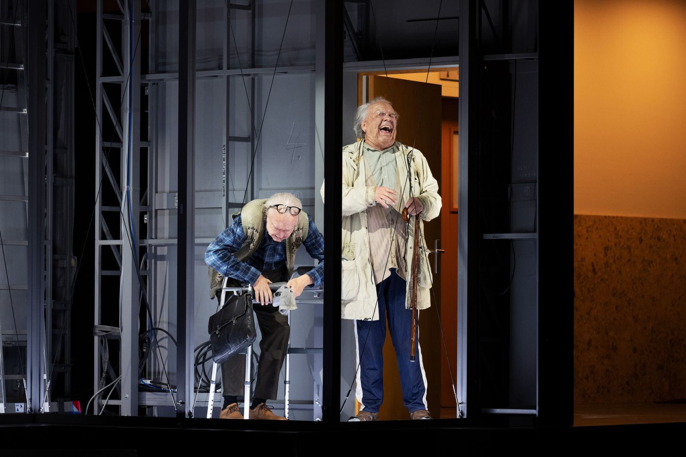
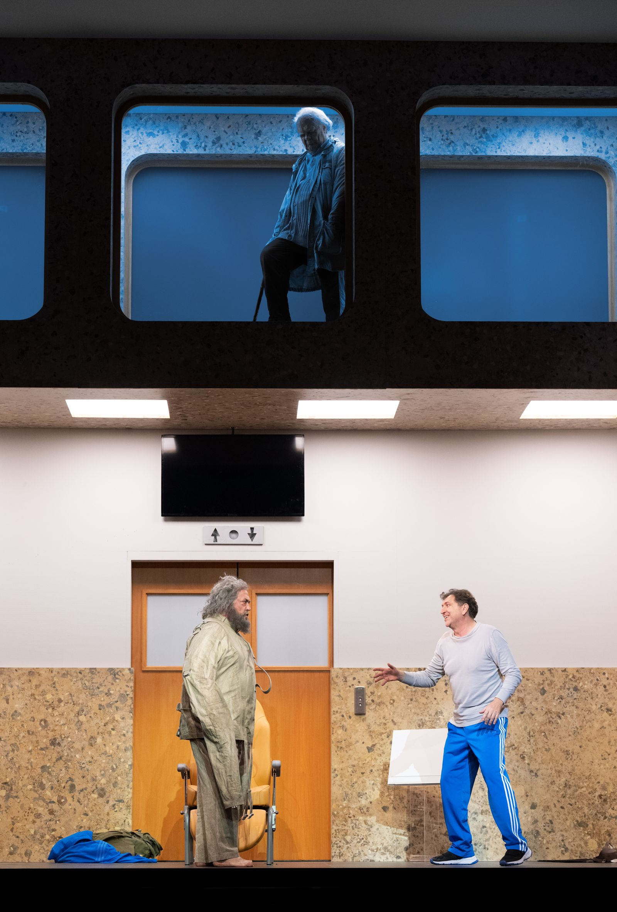
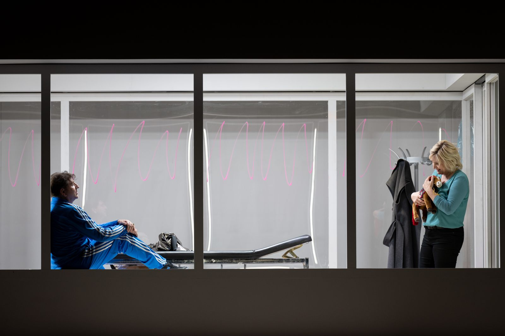

|   |  |
|:--|:--|
| Musikalische Leitung | Christian Thielemann              |
| Inszenierung, Bühne | Dmitri Tcherniakov                 |
| Szenische Einstudierung, Spielleitung | Lilli Fischer    |
| Spielleitung | José Darío Innella                        |
| Kostüme | Elena Zaytseva                                 |
| Licht | Gleb Filshtinsky                                 |
| Video | Alexey Poluboyarinov                             |
| Siegfried | Andreas Schager               |
| Mime | Stephan Rügamer    |
| Der Wanderer | Michael Volle    |
| Alberich | Jochen Schmeckenbecher    |
| Fafner | Peter Rose    |
| Erda | Anna Kissjudit    |
| Brünnhilde | Anja Kampe    |
| Stimme des Waldvogels | Kathrin Zukowski    |

Siegfried, der Sohn Siegmunds und Sieglindes, ist ein tatkräftiger junger Mann. Vom verschlagenen Nibelungen Mime aufgezogen, kennt er seine Eltern nicht – einzig Bruchstücke eines Schwertes hat sein Vater hinterlassen. Siegfried schmiedet den Stahl neu zu einer starken Waffe, mit der er den Drachen Fafner erschlägt. Dieser hatte den Ring gehütet, den Siegfried nun an sich nimmt. Und er gewinnt Brünnhilde, die er aus dem Schlaf erweckt.

Im dritten Teil seiner Ring-Tetralogie lässt Wagner märchenhafte Motive in seine große mythologische Erzählung einfließen. Die allbekannte Geschichte von „Einem, der auszog, das Fürchten zu lernen” hat sich im Siegfried ebenso niedergeschlagen wie Episoden aus dem mittelalterlichen „Nibelungenlied”. Naturbilder wie das berühmte „Waldweben” zeugen von den besonderen klangmalerischen Fähigkeiten Wagners, auch die musikalischen Darstellungen von Feuer und Gewitter, von Schmelzen und Schmieden und anderem mehr gelingen sehr plastisch. Ein letztes Mal tauchen die Götter auf: Der einst so mächtige Wotan hat sich zum Wanderer gewandelt, der jedoch kaum mehr aktiv in die Handlung eingreift, die zuvor noch allwissende Erda, die im Rheingold das Ende der Götter ahnungsvoll angekündigt hatte, weiß vom Gang der Welt nichts mehr. Die Zukunft scheint Siegfried und Brünnhilde zu gehören, ihr Jubel kennt keine Grenzen. Und doch spürt man, dass noch ein tragisches Finale bevorsteht.

