|   |  |
|:--|:--|
| Musikalische Leitung | Christian Thielemann              |
| Inszenierung, Bühne | Dmitri Tcherniakov                 |
| Szenische Einstudierung, Spielleitung | Lilli Fischer    |
| Spielleitung | José Darío Innella                        |
| Kostüme | Elena Zaytseva                                 |
| Licht | Gleb Filshtinsky                                 |
| Video | Alexey Poluboyarinov                             |
| Siegfried | Andreas Schager        |
| Gunther | Lauri Vasar   |
| Alberich | Jochen Schmeckenbecher   |
| Hagen | Mika Kares   |
| Brünnhilde | Anja Kampe   |
| Gutrune | Clara Nadeshdin   |
| Waltraute | Marina Prudenskaya   |
| Erste Norn | Anna Kissjudit   |
| Zweite Norn | Kristina Stanek   |
| Dritte Norn | Daniela Köhler   |
| Woglinde | Evelin Novak   |
| Wellgunde | Natalia Skrycka   |
| Floßhilde | Ekaterina Chayka-Rubinstein   |

Der Schicksalsfaden der Nornen reißt, die Welt gerät aus den Fugen, die Götter schauen tatenlos ihrem eigenen Untergang zu. Die Menschen streiten um Vorherrschaft. Brünnhilde und Siegfried werden in diese Machtspiele hineingezogen, wesentlich von Hagen initiiert, dem Sohn des ersten Ring-Besitzers Alberich. Siegfried kommt zu Fall – sein Tod wird zum Vorboten einer Katastrophe, aus der jedoch Hoffnung auf etwas Neues erwachsen kann.

Mit der Götterdämmerung setzt Wagner den Schlussstein zu seinem monumentalen vierteiligen Opus, das er unter dem Eindruck der Revolution von 1848/49 konzipiert und nach vielen Mühen und längerer Unterbrechung 1874 vollendet hat. In vielfacher Weise sind die thematischen wie musikalischen Linien miteinander verflochten, überaus kunstvoll und komplex. Die Handlungsstränge und -fäden, auch die zwischenzeitlich fast in Vergessenheit geraten, werden wieder aufgenommen, im Sinne eines bis in die letzten Verästelungen hinein entfalteten großen Dramas. Die Idee zu einem Heldenepos mit dem Titel „Siegfrieds Tod“ – aus dem die spätere Götterdämmerung mit weiteren Horizonten heraus entwickelt wurde – hatte die Keimzelle des Rings gebildet. Sukzessive entwarf Wagner die Vorgeschichten dazu, von altnordischen Sagen und Legenden inspiriert, sodass die Welt der Götter mit derjenigen der Menschen zusammengeführt wurde. Er spiegelte damit seine eigene Gegenwart und lässt auch uns Heutigen unendlichen Raum für eigene Deutungen und eigenes Nachdenken.

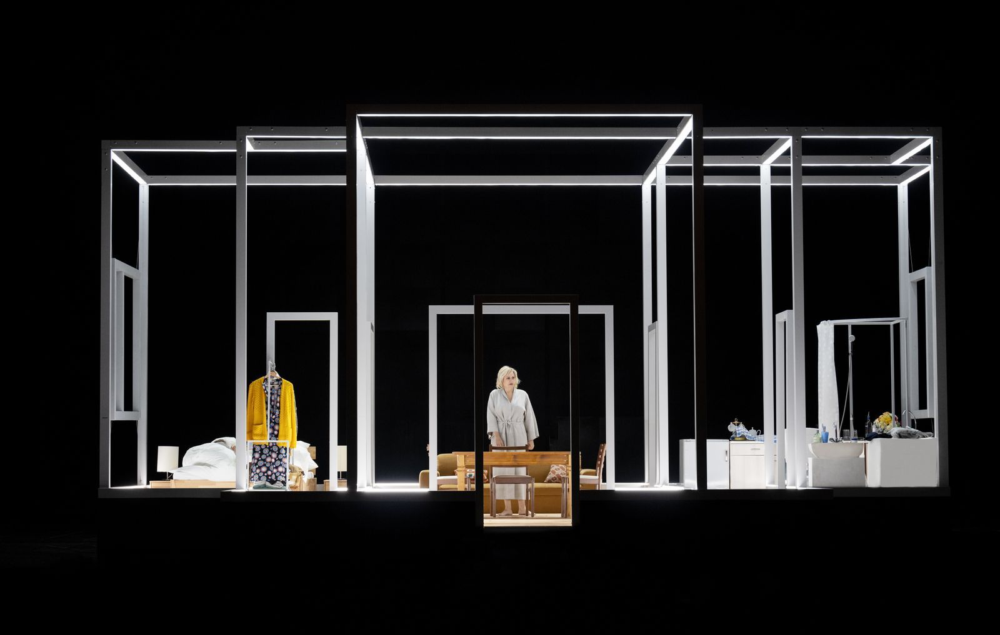
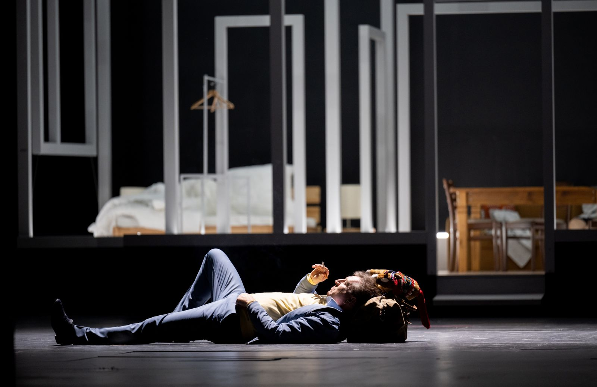
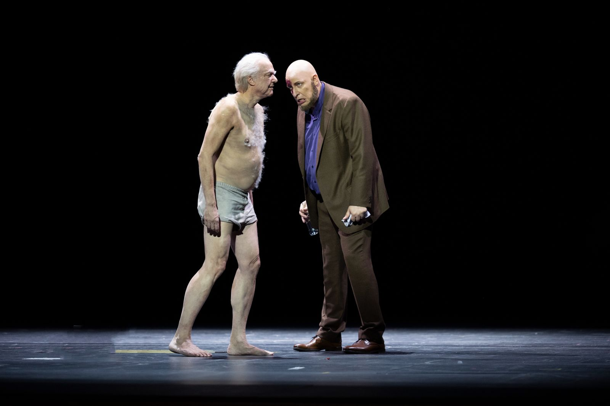
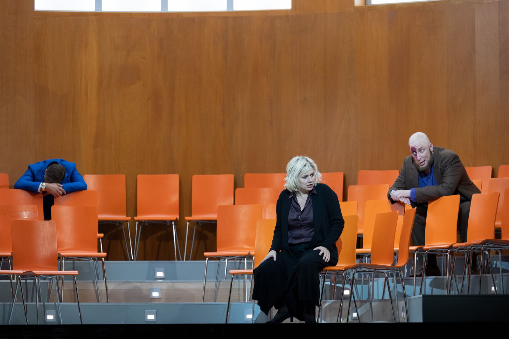

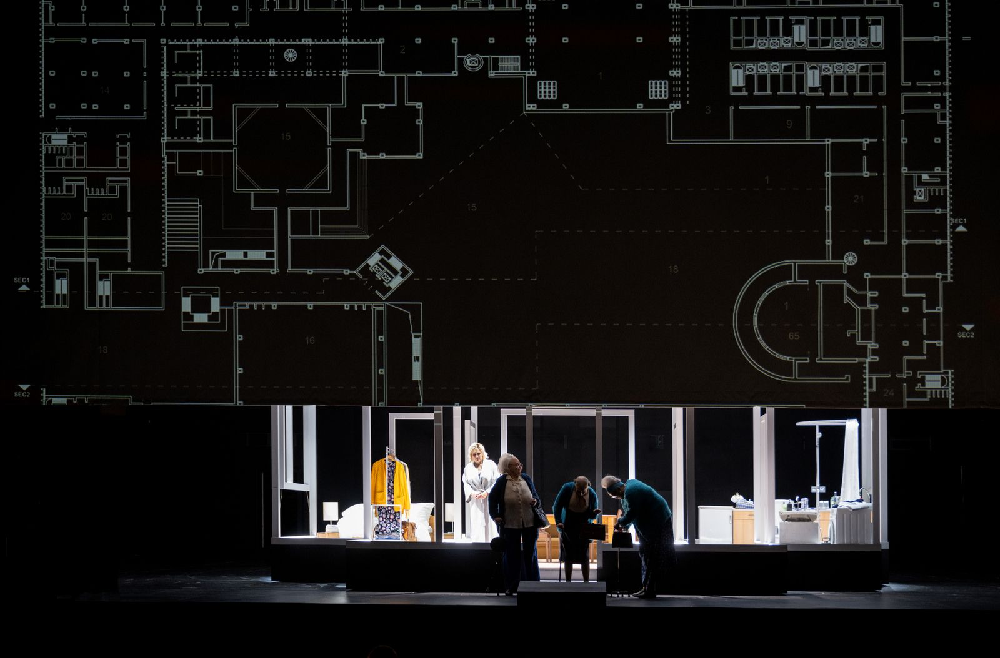
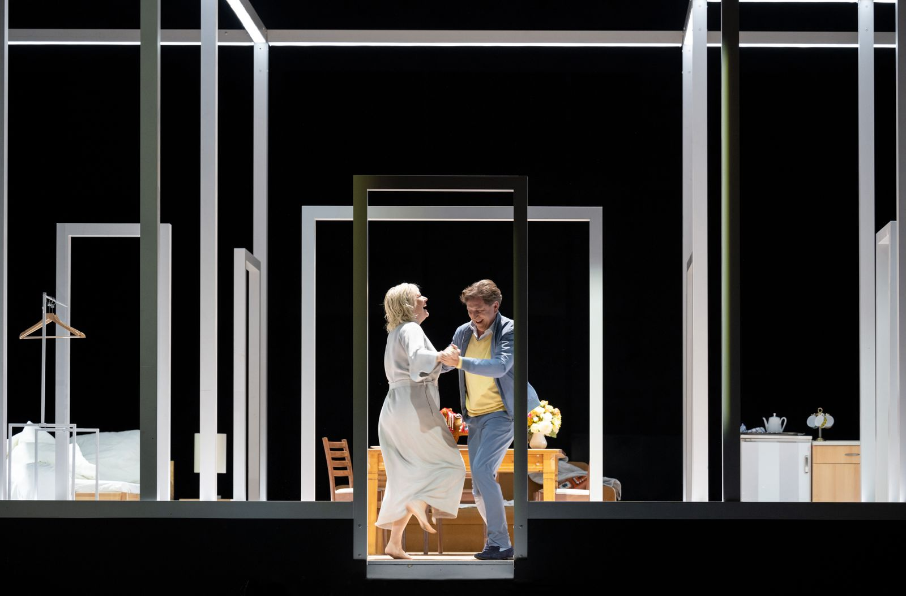

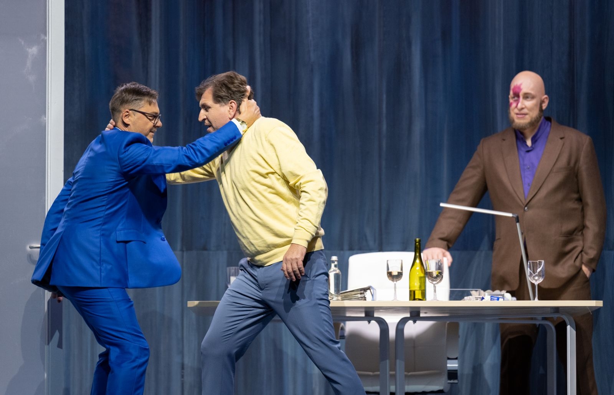

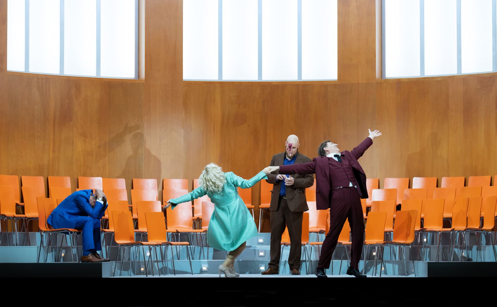
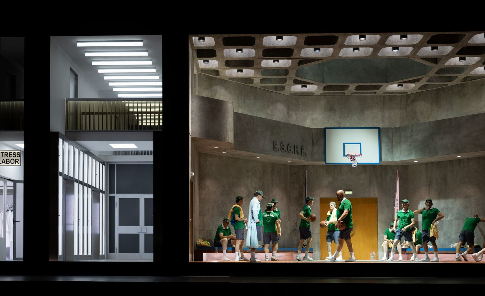
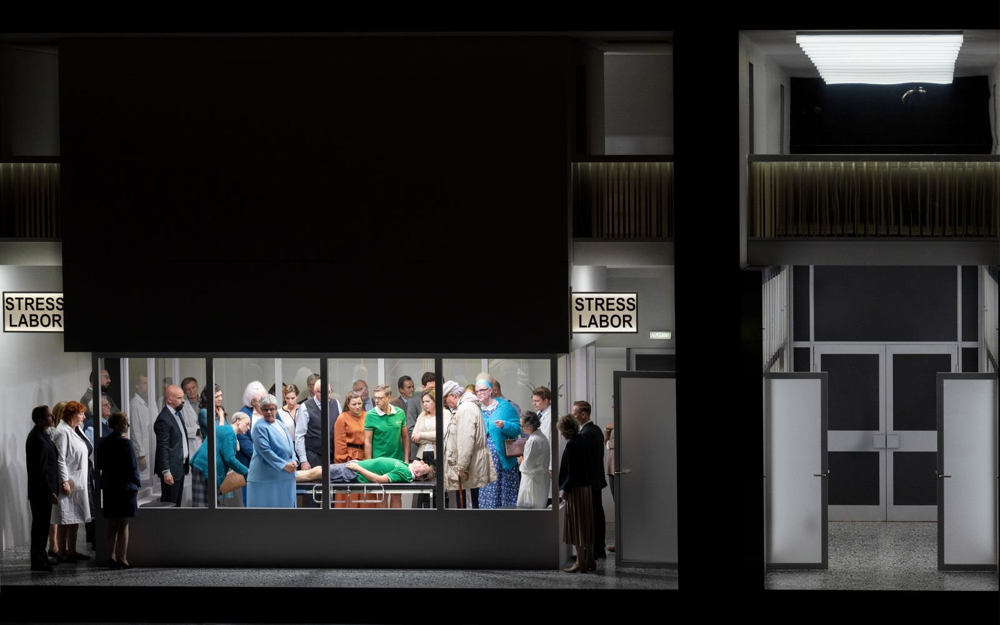
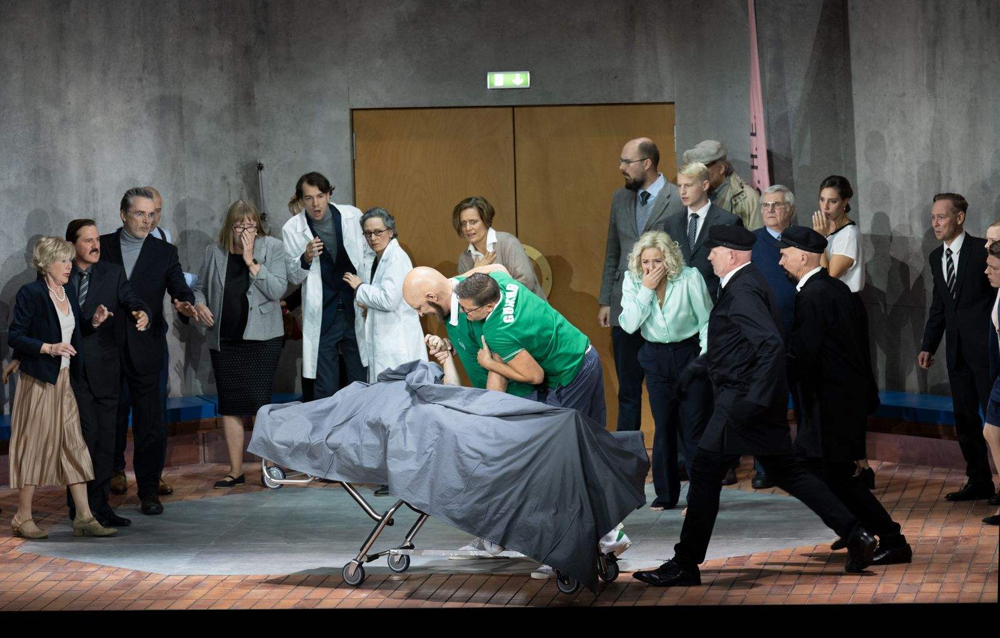
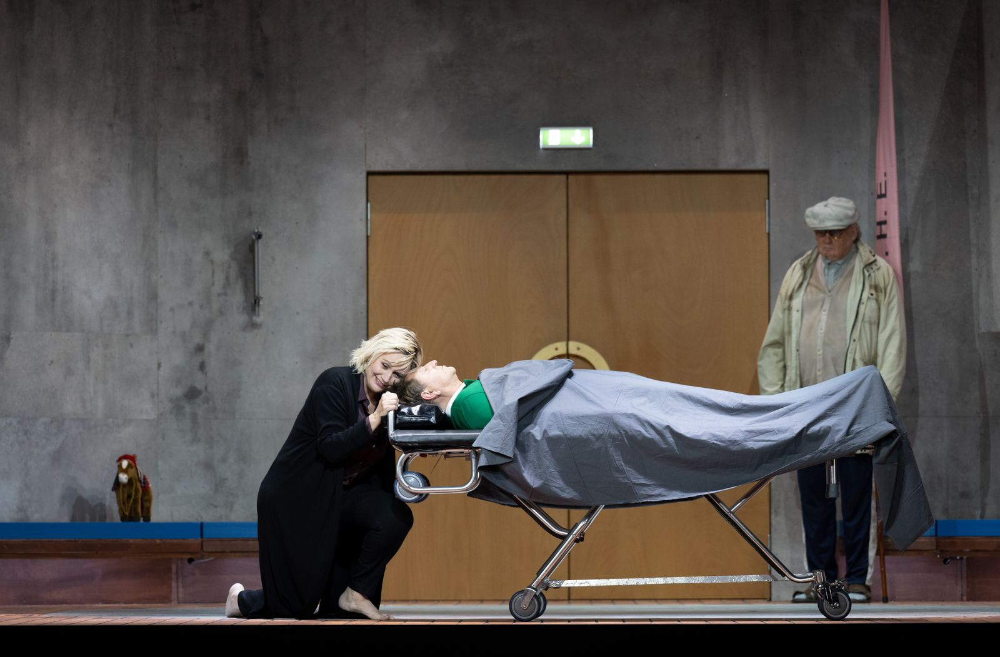
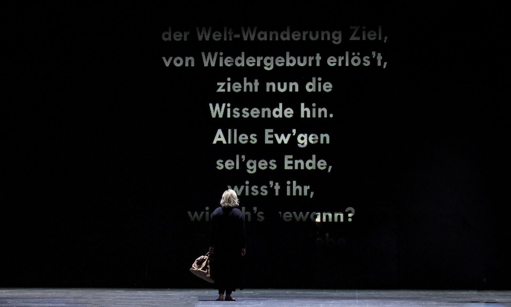
