|   |  |
|:--|:--|
| Conductor | Susanna Mälkki |
| Director |  Bárbara Lluch |
| Stage design | Urs Schönebaum |
| Costumes | Clara Peluffo |
| Dramaturgy | Yvonne Gebauer |
| Lighting | Urs Schönebaum |
| Tristan | Clay Hilley |
| Marke | Brindley Sherratt |
| Isolde | Lise Davidsen |
| Kurwenal | Tamasz Konieczny |
| Melot | Roger Padulles |
| Brangäne | Ekaterina Gubanova |
| Ein Hirt | Albert Casals |
| Ein Steuermann | Albert Casals |

### Scherzo

V tradici legendárních severských sopranistek, jako jsou Kirsten Flagstad a Birgit Nilsson v Wagnerově pantheonu, Davidsen září svou jedinečnou osobností, inteligencí a hudební citlivostí a oživuje Isoldu s bouřlivou vokální brilantností, vždy sebejistou, s čistým hlasovým projevem v nejlyričtějších momentech a silnými vysokými tóny. Díky své kráse a hlasové kvalitě, technické dokonalosti a vynikající muzikálnosti je úžasnou Isolde, plnou jemných nuancí a expresivní plnosti, velmi podobnou Flagstad v tom, jak zprostředkovává poezii a emoce postavy, a s přesností, konzistencí a dopadem ve vysokých tónech, které připomínají svět Nilsson.

### Platea

Ve druhém dějství začala rozvíjet všechny harmonické tóny tohoto nepopsatelného, obrovského nástroje s jeho nádherným, diamantovým zabarvením, zázračně vyváženým mezi kovem a sametem, homogenním ve všech rejstřících a promítaným silou hurikánu. Není pochyb o tom, že jsme svědky vokálního fenoménu, jehož hranice jsou dosud neznámé, a zpěvačky, která již stojí po boku velkých wagnerovských sopranistek, od své krajanky Kisten Flagstad po velkou Birgitte Nilsson, včetně legend jako Martha Mödl, Astrid Varnay a novější Waltraud Meier.

### Observer: Is Lise Davidsen the soprano of the century  

Banners fluttered from Barcelona’s wrought-iron lamp posts last week to proclaim a cultural event spoken of, with only the faintest whiff of hyperbole, as a before-and-after moment in the history of international opera. Even qualified to “recent performance history” – composers might otherwise take exception – this was a landmark occasion, the civic excitement justified, the jostle of opera movers and shakers from all over the globe adding to the foyer buzz in the Gran Teatre del Liceu. This was one of those rare and blissful nights when dropped jaws silenced noisy opinion in the queue for coats after.

The fuss? The Norwegian soprano Lise Davidsen, scaling the heights as the most in-demand singer in the world, had chosen the Catalan city to make her debut as Isolde (having previously sung only Act II, in Munich) in a new production of Wagner’s **Tristan und Isolde** (1865). This was also Davidsen’s return to the stage after giving birth to twins last May. Her Tristan was the American Clay Hilley, one of the small handful of heldentenors – heroic tenors – who can excel in the fiendish role, maintaining stamina right through to the end, which he did, with sterling energy and distinction.

Davidsen’s career took off a decade ago with small Wagnerian roles and the promise, never automatically fulfilled, that the great ones would follow. Now aged 37 and in her prime, she felt ready to sing the most musically complex, as well as one of the longest roles in any opera: Wagner’s Irish princess, illicitly bound in love to the knight Tristan, whose very name encompasses the word sadness. Incandescent with fury at the start, Isolde is transfigured by grief at the end some four hours later, with her farewell music, the Liebestod, some of the most revered minutes (around eight) in the repertoire. Isolde has made careers, and also ended a few.

Susanna Mälkki conducted the work for the first time, applying her incisive expertise with contemporary music to Wagner’s immense chromaticism. The Liceu orchestra triumphed, if occasionally loud when soft would have been even better. The production by Barbara Lluch was spare, intelligent and perceptive. Naturally, it provoked a few boos when she and her team (designer Urs Schönebaum) took their bow: Wagner’s ownership by disciples knows no equal; many have strong views. The visual style was *Game of Thrones* (man buns, black tunics) with a wave at the Duc de Barry (medieval gowns and long hair) and Anish Kapoor (a vast black mirror-moon eclipse affair) but none the worse for all that. It looked severe and handsome.

Lluch concentrated on clarity and emotional storytelling, performers only occasionally overdoing gesture or detail. She showed great skill in helping Davidsen and Hilley through the static ecstasy of Act II, where the action is entirely in orchestra and voices. King Marke, betrayed by his beloved friend Tristan, was sung with affecting intensity by the British star bass Brindley Sherratt. His turning away from the besotted lovers, silhouetted in darkness, was the epitome of sorrow. The Polish baritone Tomasz Konieczny, first trained as an actor with physical skills to show for it, was luxury casting as Kurwenal. Ekaterina Gubanova’s Brangäne was an impetuous and busy foil to Isolde’s monumental composure. Roger Padullés made much of the small, villainous role of Melot.

The night was Davidsen’s, and everyone’s. Her vocal control, her range of expression and colour, her soft voice singing, her strength and volume in climactic moments felt natural and without strain throughout. She knows how to use her height, never upstaging, understanding the power of stillness, drawing attention only when to do so is required. Her almost disembodied, dreamlike account of the Liebestod was unforgettable, floating her final notes with breathtaking daring. She carries a weight of expectation, heralded as a talent that comes only every half century or so, mentioned in the same breath as Maria Callas and Luciano Pavarotti. Where she differs from both is in the modesty of her character and presentation, even now that the world is at her feet, any fee hers for the asking. We must see where this responsibility takes her.

One brief mention of **La Traviata**, back at the Royal Opera for the umpteenth revival of Richard Eyre’s production, in Bob Crowley’s grand designs. Westminster City Council should have adorned the lamp posts around Covent Garden with word that Ermonela Jaho was back to sing Violetta, marking 300 performances, and sharing the run with two others. You can see it in a cinema near you this week, or live in the theatre until 17 February. This glorious production is well worth catching.

*The Liceu production of Tristan und Isolde is available from* *15 February* *on the digital platform* [LiceuOpera+.](https://liceuoperaplus.com/) *Davidsen will sing the role at the Metropolitan Opera New York, streamed on the Met Opera Live on* *21 March 2026, 4pm. She performs Schubert at Wigmore Hall, London, and Aldeburgh festival in May-June*

### Lohengrin

Premiéra nové inscenace Tristana a Isoldy v Gran Teatre del Liceu byla z několika důvodů provázena velkými očekáváními. Hlavním z nich byla skutečnost, že Lise Davidsen, jedna z nejuznávanějších wagnerovských sopranistek současnosti, zazpívá poprvé ve své kariéře roli Isoldy, jednu z nejnáročnějších ženských rolí v operním repertoáru v každém ohledu.

Dalším důvodem očekávání bylo, že žena, Susanna Mälkki, poprvé povede orchestr Liceu a bude dirigovat Wagnerovu operu v tomto divadle. Třetím důvodem bylo uvedení nové inscenace díla v režii Bárbary Lluch, čímž se naplnilo ženské trio ovládající klíčové prvky Tristana a Isoldy – největšího, nejmytického, nejvýstřednějšího a nejvyčerpávajícího (i pro diváky) příběhu lásky a smrti, jaký kdy zdobil jeviště, měřítka a nevyhnutelného milníku v historii západní kultury.

Davidsen více než splnila vysoká očekávání, která vzbudila. Není pochyb o tom, že jsme svědky zrodu velké Isoldy příštího desetiletí a jedné z nejlepších interpretů této legendární ženské role vůbec. Být svědkem jejího debutu v této roli, kterou v březnu představí v newyorské Metropolitní opeře, bylo skutečným privilegiem.

Vokální bohatost norské sopranistky je ohromující. Když zpívá, i v těch nejnáročnějších pasážích, nikdy se nezdá, že by se blížila limitům svých schopností, ať už jde o rozsah nebo dynamiku; vždy se zdá, že má hlasu nazbyt. To znamená, že její zpěv, technicky bezchybný a založený na bezvadně kontrolované dechové opoře, vždy zní „příjemně“ a nikdy není pronikavý nebo vynucený; tón je zaoblený, expresivní a bohatý n:a nuance. Davidsenovou vokální dokonalost ještě umocňuje vynikající hudební citlivost a velká jevištní inteligence, díky nimž má postavu po celou dobu plně pod kontrolou. Snad v oslavovaném finále Liebestod byly v premiérový večer patrné nepatrné známky hlasové únavy, které nepochybně v následujících představeních zmizí a jsou zcela pochopitelné u zpěvačky, která se vracela na jeviště poprvé po téměř roční nepřítomnosti z důvodu mateřské dovolené (mimochodem, porodila dvojčata).

 Role Tristana byla svěřena Clayi Hilleymu, americkému tenoristovi, který se v poslední době úspěšně zaměřuje na wagnerovský repertoár. Vědom si toho, že Tristan v třetím dějství sází vše na jednu kartu, Hilley šetřil svůj hlas – možná až příliš – v prvním dějství, ve druhém byl solidní a v náročném třetím dějství dokázal předvést jak hlasovou sílu, tak výdrž. Ačkoli se ne vždy zdál být zcela spokojený s charakterizací, kterou vyžadovala inscenace, jeho Tristan, i když se nedostal do vybrané galerie historických interpretů této role, byl zcela uspokojivý.

Brangäne, nevděčná role, která je velmi náročná, ale nabízí jen málo příležitostí zazářit, byla zpívána Ekaterinou Gubanovou, specialistkou na tuto roli, která excelovala ve spektakulárním „Habet Acht!“ zpívaném z proscéniového boxu.

Kurwenala, věrného přítele hlavního hrdiny, ztvárnil polský barytonista Tomasz Konieczny, který se svým pevným a silným hlasem exceloval ve třetím dějství. Dobrý král Marke, který vždy přichází příliš pozdě, aby milencům nabídl porozumění a odpuštění, je role, kterou je třeba zpívat spíše z bolesti a smutku než z jakékoli domnělé královské majestátnosti. Brindley Sherratt, i když jeho hlas vykazoval napětí a tlak při přechodu do vyšších poloh, byl dobrým králem Markem.

Roger Padullés byl přesvědčivý jako Melot, Milan Perišić jako kormidelník a Albert Casals byl jako námořník nevyrovnaný, ale jako pastýř si vedl lépe.

Susanna Mälkki, která poprvé dirigovala kompletní Wagnerovu operu na jevišti, kompetentně vedla divadelní orchestr, vytěžila z něj velmi vysokou úroveň výkonu a prokázala jasné pochopení toho, co bylo požadováno. Mälkkiho Wagner je moderní: méně těžký, méně hutný, méně zvukových mraků a více transparentnosti, detailů, jasnosti a instrumentální diferenciace a individualizace (v tomto ohledu byly příkladné dřevěné dechové nástroje), s přísnou dynamickou kontrolou, expresivním využitím ticha a plnou silou Wagnerovy mocné orchestrace vyhrazenou pouze pro klíčové momenty. Wagner mnohem více „komorní“ než před desítkami let. Publikum zjevně ocenilo Mälkkiho práci a odměnilo orchestr i hudební vedení bouřlivým potleskem.

### La Vanguardia

Debut norské sopranistky Lise Davidsen v roli Isoldy v Gran Teatre del Liceu překvapuje od první fráze jejího vystoupení sebejistotou a jevištní přítomností této mohutné norské ženy, která je schopna předvést dokonale homogenní hlas, velkou pružnost a krásu, pečlivou výslovnost a dokonalou dikci.

Je obdivuhodné, jak dokáže předvést i ty nejjemnější tóny s dokonalým hlasovým projevem, libovolně měnit barvu hlasu, zvyšovat rozsah, dosahovat vysokých tónů s obrovským dosahem a nádherným zvukem spolu s dokonale podloženými hlubokými tóny: její působivé pěvecké schopnosti z ní dělají světovou špičku v tomto repertoáru.

Gran Teatre del Liceu se velmi správně rozhodlo nabídnout v tomto představení tři ženské pohledy, které se současně staví do čela jednoho z nejkomplexnějších, nejnáročnějších a nejsymboličtějších Wagnerových děl, protože debut norské sopranistky doprovázela přítomnost finské hudební ředitelky Susanny Mälkki na dirigentském pódiu a nová inscenace španělské režisérky Bárbary Lluch, což tvoří ženský trojúhelník, který je skutečným milníkem v uměleckém životě barcelonského kolosea.

Premiéra byla také velkým triumfem pro Susannu Mälkki, která od úvodní předehry excelovala jako hudební ředitelka a nabídla velmi pečlivou, ale zároveň temperamentní a expresivní interpretaci, jakou si tato výjimečná a rozsáhlá partitura zaslouží. Mälkki neustále věnovala pozornost hlasům a doprovázela je s elegancí jak v nejjemnějších momentech plných výrazných tich, tak v symfonických vlnách, které musí pokrýt hlasitost a projekci požadovanou německým skladatelem.

Toto hudební vedení bude ještě dlouho vzpomínáno díky nasazení symfonického orchestru Liceu v jeho velkém okamžiku, který předvedl zvláštní souhru smyčců, dokonalé dramatické nasazení dřevěných nástrojů a vynikající hru žesťů, za což sklidil nadšené ovace publika Liceu, které si bylo vědomo, že prožívá jeden z těch magických večerů, které se vyskytují jen velmi zřídka.

Americký tenorista Clay Hilley byl zajímavým Tristanem, jedním z mála současných interpretů této role, který dokáže držet krok s norskou sopranistkou. Hilley vynikal také propracovanou dikcí, krásným a homogenním hlasem, který dokázal bez námahy promítnout do celé rozsáhlé partitury. Jeho výkon mu vynesl četný potlesk a uznání publika v momentech obrovské krásy, jako například v milostném duetu ve druhém dějství, kde se Davidsen přizpůsobila jeho hlasu, aniž by ho přehlušila, a zejména v jeho vynikajícím výkonu v úžasném třetím dějství.

Ostatní postavy podaly vynikající výkony, zejména uznávaný polský basbarytonista Tomasz Konieczny, který ztvárnil Kurwenala jako z učebnice a prokázal své velké kvality v wagnerovském repertoáru, stejně jako vynikající Brängane v podání ruské mezzosopranistky Ekateriny Gubanové a zkušený král Marke v podání britského basisty Brindleyho Sherratta. Za zmínku stojí také výkon místních tenoristů Rogera Padullése jako Melota a Pastýře a námořníka Alberta Casalse, stejně jako vynikajícího kormidelníka srbského barytonisty Milana Perišice.

Gratulace patří také Bárbarě Lluch za její scénografický návrh, který zahrnoval minimalistickou scénu, která po celou dobu představení fungovala velmi dobře, s obzvláště krásnými a zajímavými momenty, spolu s velmi správným vedením herců, které jasně vykreslilo vývoj tohoto velkého Wagnerova díla. Možná chyběla jednota scénografie, přičemž atraktivnější byly druhý a třetí akt s velmi plastickými a krásnými scénami, které soustředily pozornost na hlavní postavy; jiné momenty byly spornější, jako například velký stůl na lodi v prvním aktu, stejně jako poněkud nadbytečné detaily, jako opakovaná vražda Tristanových mužů v Kareolu nebo sklenice, která neměla pro kouzelný lektvar velký význam.

K tomu se přidalo vynikající osvětlení Urs Schönnebauma, který byl také zodpovědný za scénografii, a vhodný kostým, zejména pro hlavní hrdinku, o který se postarala Clara Peluffo. 
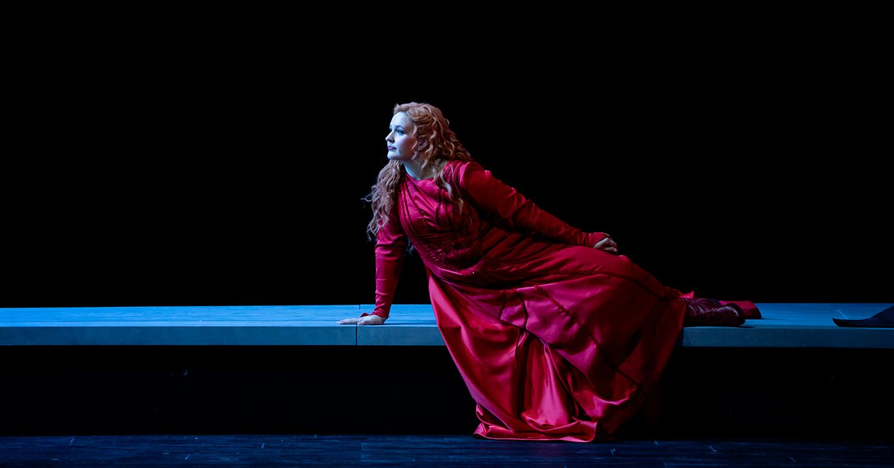
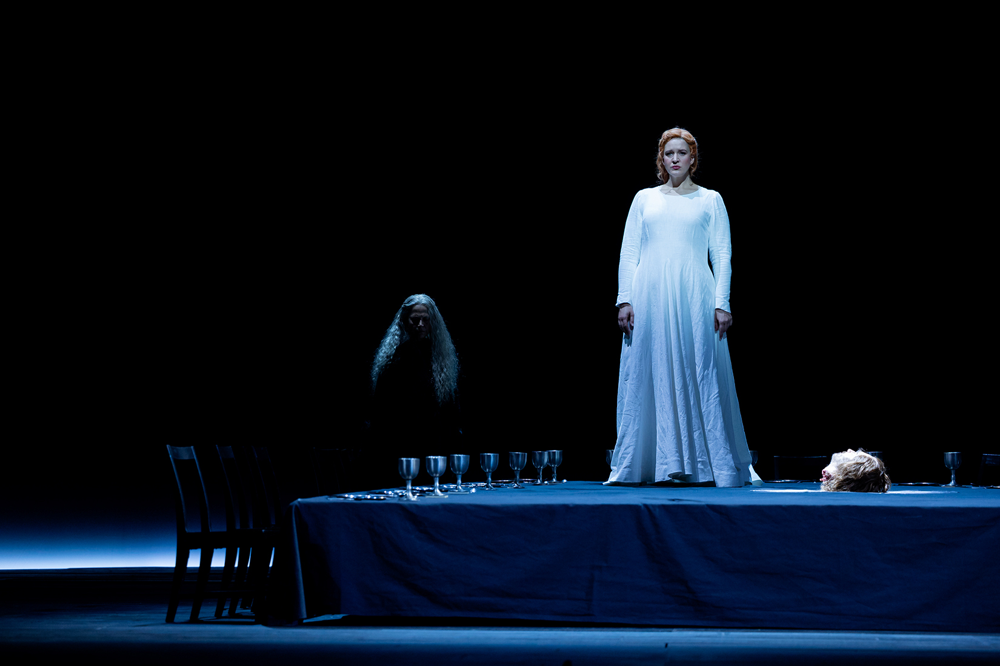
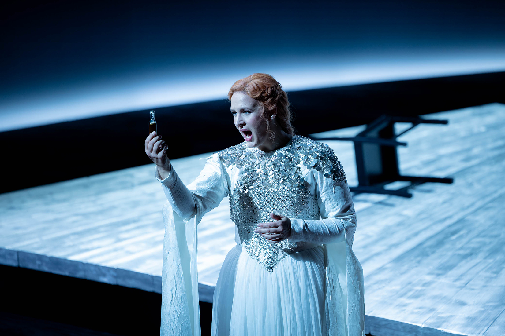
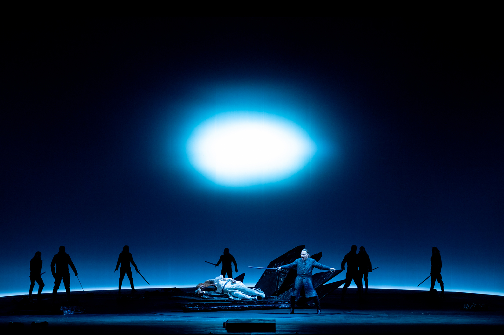
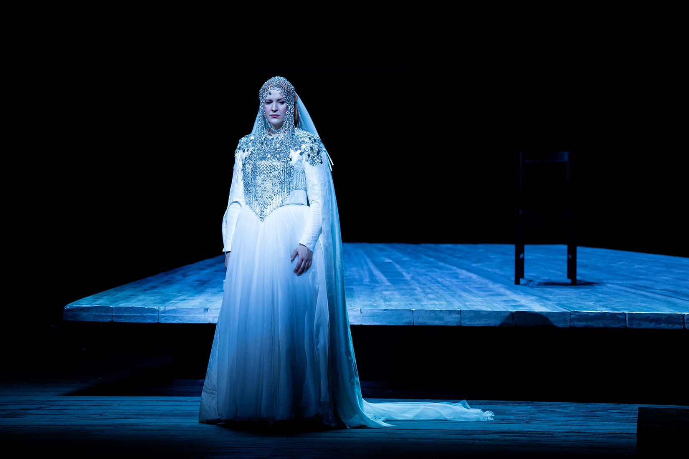
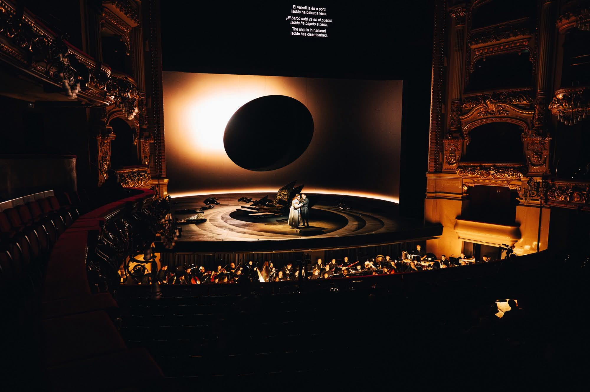
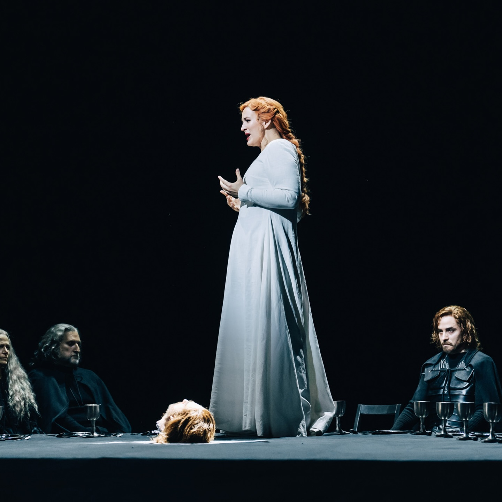
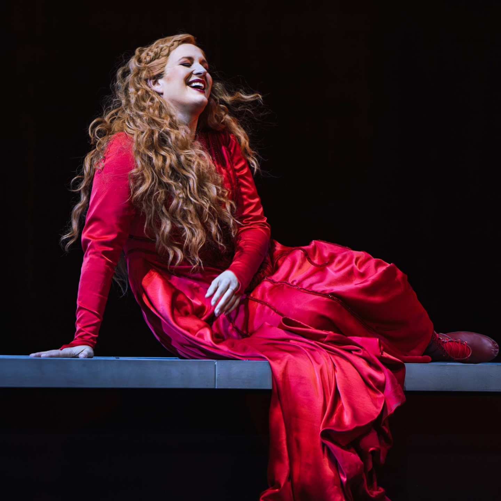

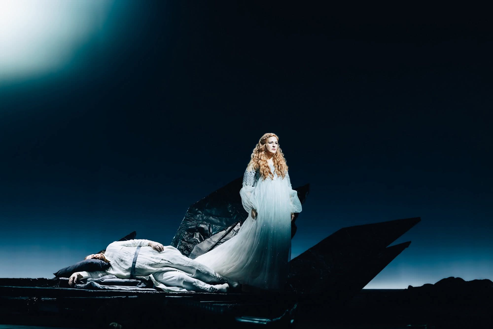
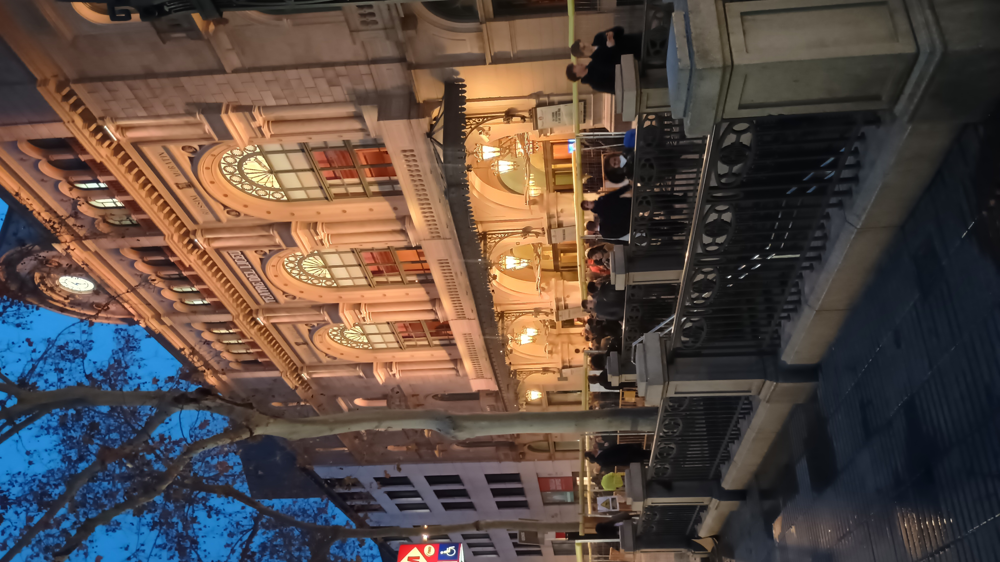
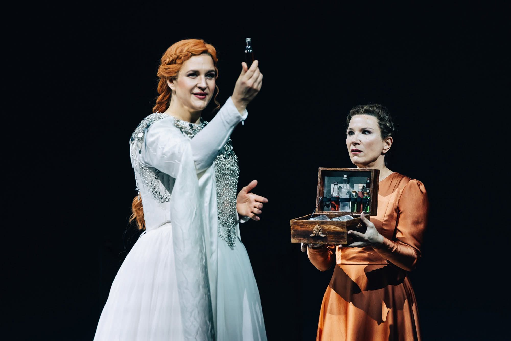

[Official website](https://www.liceubarcelona.cat/ca/tristan-und-isolde)
