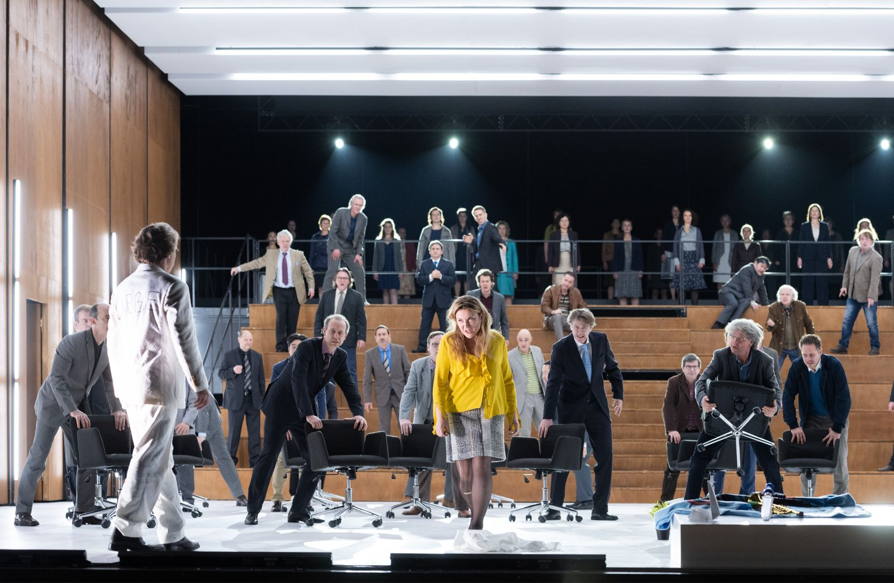
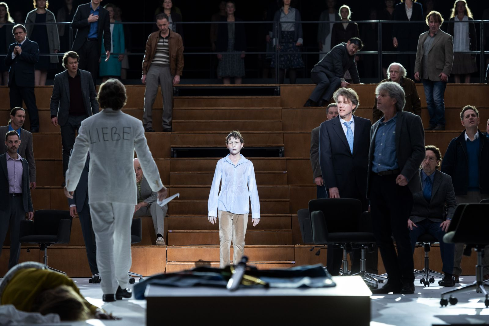
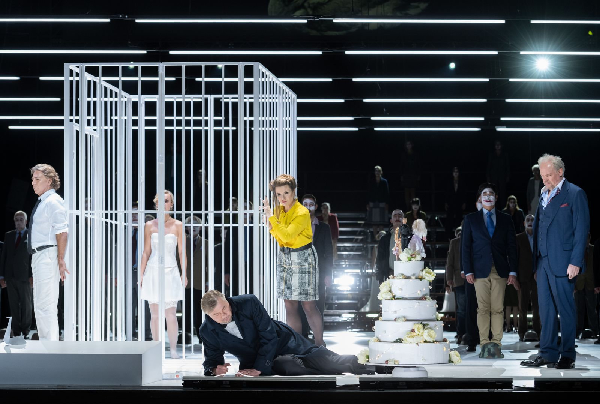

|   |  |
|:--|:--|
|    Musikalische Leitung | Simone Young  |
|    Inszenierung | Calixto Bieito  |
|    Bühne | Rebecca Ringst  |
|    Szenische Einstudierung, Spielleitung | Caroline Staunton  |
|    Kostüme | Ingo Krügler  |
|    Licht | Michael Bauer  |
|    Video | Sarah Derendinger  |
|    Einstudierung Chor | Dani Juris  |
|    Heinrich der Vogler | René Pape  |
|    Lohengrin | Eric Cutler  |
|    Elsa von Brabant | Elza van den Heever  |
|    Friedrich von Telramund | Wolfgang Koch  |
|    Ortrud | Anja Kampe  |
|    Heerrufer des Königs | Arttu Kataja  |
  
 Staatsopernchor, Staatskapelle Berlin 

