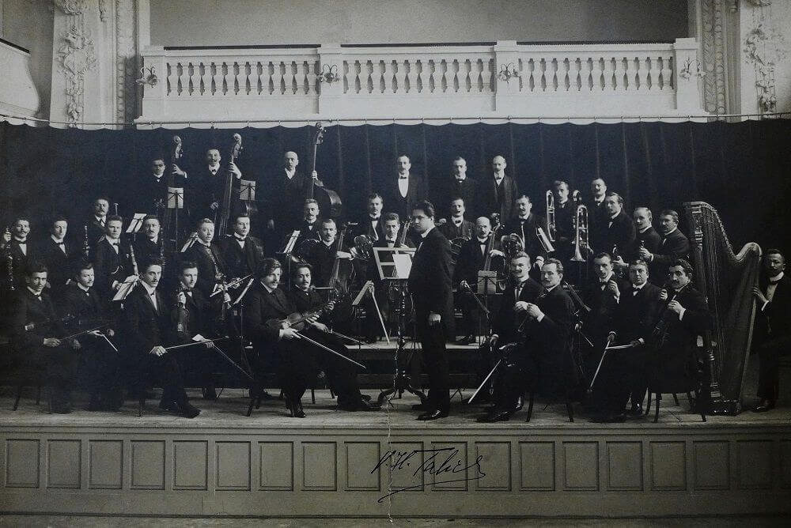

Fleur Barron, mezzosoprán 
Semjon Byčkov, dirigent
Česká filharmonie

|   |  |
|:--|:--|
| Felix Mendelssohn Bartholdy | Symfonie č. 4 A dur, op. 90 „Italská“ (27') |
| Gustav Mahler | Písně o mrtvých dětech (27') |
| Richard Wagner | Tannhäuser, předehra k opeře (14') |

