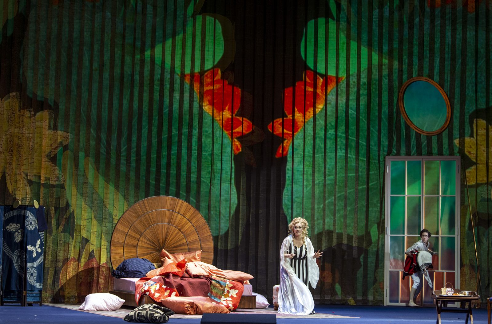
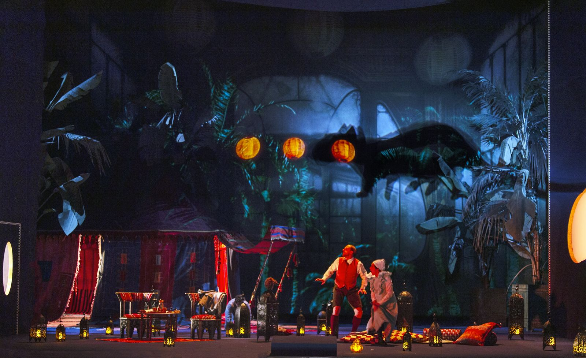

Po archaicky dramatických jednoaktovkách Salome a Elektra hledal Richard Strauss pro svou další operu lehčí, veselejší námět ve stylu Mozartových operních komedií – což byl záměr, s nímž se rád ztotožnil i Hugo von Hofmannsthal. Ve svém libretu vytvořil umělou rokokovou Vídeň s přesvědčivými, ale smyšlenými zvyky a dialekty, kterou Strauss na hudební straně ještě vylepšil anachronickými valčíky. V tomto fantazijním Vídni plném radosti ze života, frašek a tradičních třídních rozdílů, ale také plném deprese a morbidity se odráží nejen 18. století, ale především Belle Époque, která se chýlila ke konci. Straussova partitura tak opět nabízí celou bohatost orchestrálních barev, téměř bezuzdné rozkošování, které vrcholí v závěrečném triu, které je z hlediska hudební krásy nepřekonatelné, ale také ukazuje hluboké zlomy. Jen několik let před rozpadem Rakousko-Uherska se Růžový kavalír stává rozloučením s celou epochou.

|   |  |
|:--|:--|
|  Musikalische Leitung | Christian Thielemann |
|  Inszenierung | André Heller |
|  Szenische Einstudierung, Spielleitung | Katharina Lang |
|  Bühne | Xenia Hausner |
|  Kostüme | Arthur Arbesser |
|  Licht | Olaf Freese |
|  Video | Günter Jäckle, Philip Hillers  |
|  Einstudierung Chor | Gerhard Polifka |
|  Feldmarschallin Fürstin Werdenberg | Julia Kleiter |
|  Baron Ochs auf Lerchenau | Peter Rose |
|  Octavian | Patricia Nolz |
|  Herr von Faninal | Roman Trekel |
|  Sophie | Nikola Hillebrand |
|  Jungfer Marianne Leitmetzerin | Clara Nadeshdin |
|  Valzacchi | Karl-Michael Ebner |
|  Annina | Christa Mayer |
|  Ein Polizeikommissar | Friedrich Hamel |
|  Haushofmeister bei der Marschallin | Florian Hoffmann |
|  Haushofmeister bei Faninal | Junho Hwang |
|  Ein Notar | Carles Pachon |
|  Ein Wirt | Stephan Rügamer |
|  Ein Sänger | Andrés Moreno García |
|  Eine Modistin | Sonja Herranen |

 

