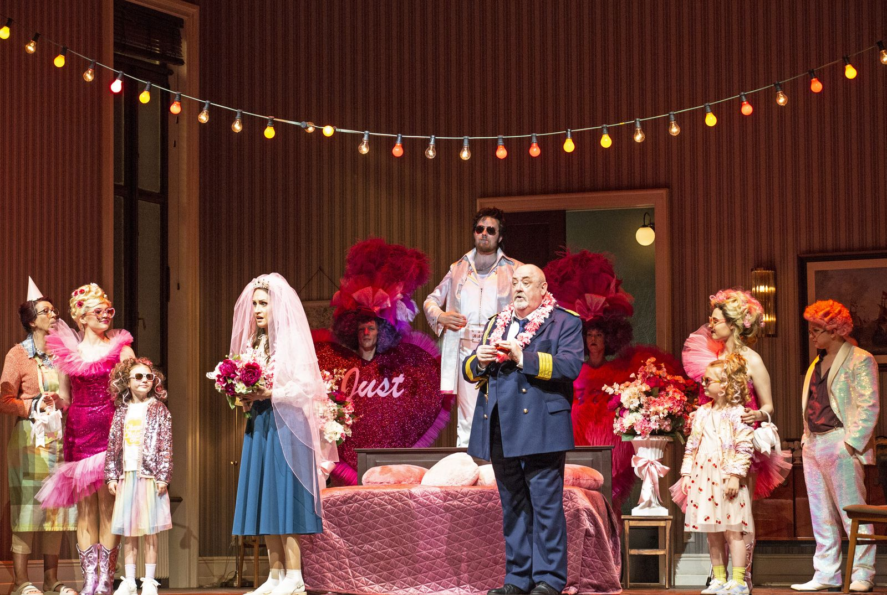



Pro Richarda Strausse, který se blížil sedmdesátce, bylo velkým štěstím, když se na počátku 30. let 20. století stal jeho novým libretistou renomovaný literát Stefan Zweig, známý svými uměleckými, myšlenkově hlubokými romány, novelami a divadelními hrami. Ve vzájemně inspirativní spolupráci vytvořili podle komedie Bena Jonsona z doby Shakespeara skutečně komickou operu plnou výrazných postav, tempa a vtipu, ale také velkého zamyšlení. "Opera je trefou do černého, i když možná až v 21. století," řekl sám Strauss, kterému se v těžké, temné době podařilo vytvořit dílo vysoké kompoziční virtuozity a uvolněné veselosti, příběh lidí, kteří touží po klidu nebo se oddávají shonu. Režisér Jan Philipp Gloger s ním debutuje ve Státní opeře – a pro Christiana Thielemanna je to první nová inscenace jako generálního hudebního ředitele domu, funkce, kterou kdysi zastával i Strauss.

|   |  |
|:--|:--|
| Musikalische Leitung | Christian Thielemann |
| Inszenierung | Jan Philipp Gloger |
| Szenische Einstudierung, Spielleitung | Caroline Staunton |
| Bühne | Ben Baur |
| Kostüme | Justina Klimczyk |
| Licht | Tobias Krauß |
| Video | Leonard Wölfl |
| Choreographie | Florian Hurler |
| Einstudierung Chor | Dani Juris |
| Sir Morosus | Peter Rose |
| Seine Haushälterin | Evelyn Herlitzius |
| Barbier Schneidebart | Samuel Hasselhorn |
| Henry Morosus | Siyabonga Maqungo |
| Aminta, seine Gattin | Serena Sáenz |
| Isotta | Serafina Starke |
| Carlotta | Rebecka Wallroth |
| Morbio | Dionysios Avgerinos |
| Vanuzzi | Manuel Winckhler |
| Farfallo | Friedrich Hamel |
