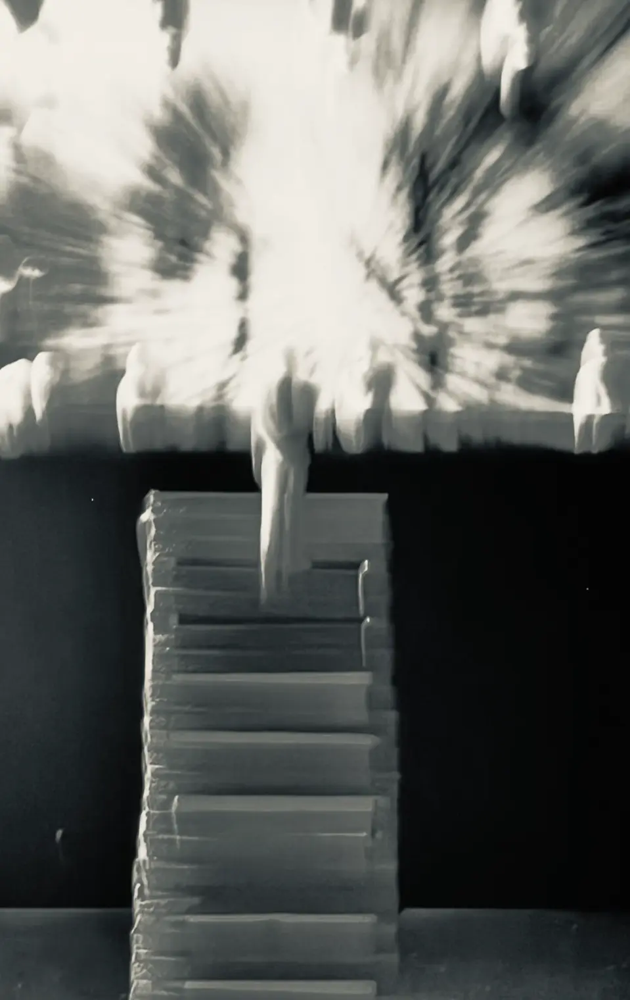



Rienzi, Wagnerova třetí opera, byla kdysi jeho největším úspěchem. Bayreuthská verze pro rok 2026 zastává tezi, že kdyby v roce 1871 vznikla „konečná“ verze, Rienzi by si zcela jistě našel své místo v bayreuthském kánonu děl „od Bludného Holanďana“. Deset děl takzvaného „bayreuthského kánonu“ totiž nevychází ani z poslední vůle, ani z rozhodujících formulací v zakládací listině Nadace Richarda Wagnera v Bayreuthu, ale výhradně z dopisů Wagnera králi Ludvíkovi II. Bavorskému z roku 1882.

Tým se snažil o verzi, která stejně pečlivě zohlednila vrstvy tradice jako historii recepce. Stejně tak byla pečlivě zohledněna Rienziho filologie posledních desetiletí. Kromě toho se tým pokusil zpřístupnit nové zdroje a rekonstruovat části partitury, které byly považovány za ztracené.

Forma a skladba díla samozřejmě nevyhnutelně vedou k otázce zkratek a dějového průběhu. I v tomto případě se tým řídil hudební dramaturgií stejně jako Wagnerovými – i pozdějšími – vlastními hodnoceními. Když Wagner v roce 1871 píše: „V Rienzim byste měli vidět ten oheň; byl jsem hudebním ředitelem a napsal velkou operu; že vám tento hudební ředitel poté dal takové oříšky k rozlousknutí, by vás mělo překvapit“, je patrná hodnota tohoto „ohně“, který byl pro pozdější „oříšky“ stejně nezbytný jako „každé finále jako opojení, opilecký nesmysl utrpení a radosti“ (1878). Ale i sebekritické poznámky, jako „prázdnota, kterou odkrýváte, když vás nic nenapadá“ (1879), byly v verzi pro rok 2026 zohledněny. Pro tým byla důležitá nejen srozumitelná posloupnost dějových linií, ale i vnitřní struktura jednotlivých hudebních čísel. Zde hraje podstatnou roli také „nezdravý“ vztah Rienziho k jeho sestře Irene. Nejen proto, že odkazuje na pozdější incestní konstelaci ve Valkýře, ale také proto, že je zásadní pro emocionální – a tím i hudebně formovaný – milostný trojúhelník Rienzi-Irene-Adriano. Pro režijní koncepci tedy byla zásadní otázka, kde Wagner hudebně prozkoumal psychologii a emocionalitu postav v jejich hloubce. Zdálo se důležitější zabývat se otázkou, co politika dělá z lidí, a ne naopak, a kde lze v notovém textu najít hudebně-dramatické zpracování těchto otázek. Právě tyto emocionální konstelace – na pozadí politických dějin – vytvářejí vynikající kvalitu jednotlivých čísel a scén.

I kdyby Wagner napsal pouze Rienziho, je tato opera jedinečným mistrovským dílem sui generis, které by si i bez autorství pozdějšího mistra z Bayreuthu našlo své místo v historii evropského hudebního divadla.

### Historie vzniku

Rienzi – poslední z tribunů, Wagnerova třetí dokončená opera, vychází z historického románu Edwarda Bulwer-Lyttona Rienzi, the Last of the Roman Tribunes. Na rozdíl od románu Wagner velmi dovedně obohatil děj milostným příběhem mezi Rienziho sestrou Irene a šlechtickým potomkem Adrianem. Wagner si i v pozdějších letech uvědomoval, jak velmi byl tento milostný příběh na pozadí historicko-politického děje pro operu podstatný: „To je ještě pozůstatek staré tragédie, kde vždy musel být nějaký milostný vztah; […] mému Rienzimu tento milostný vztah pro Francouze chyběl; a přesto jsem i tam měl ten pozůstatek.“ Rienzi navenek zcela zapadá do tradice francouzské Grand' Opéra, nejnáročnějšího žánru evropského hudebního divadla – ale pouze navenek. Výběrem historického tématu se Wagner snažil splnit očekávání tohoto žánru stejně jako v pětivěté kompozici, a rozsáhlé téma Wagnerovi nabídlo mnoho oblíbených typů scén, které využil pro masové výstupy a akustické prostorové efekty. Rienzi byl Wagnerovým prvním velkým úspěchem a jeho premiéra 20. října 1842 v Královském dvorním divadle v Drážďanech znamenala jeho průlom jako operního skladatele.

### Recepce v době nacismu

Od 20. století je recepce Rienziho díla do značné míry zastíněna opakovaně diskutovaným vlivem na Hitlera a jeho funkcionalizací v nacismu. Hitlerovo sebereflexivní autobiografické hodnocení sebe sama jako lidového tribun, který se vypracoval z chudých poměrů, však obsahovalo dvě chyby. Za prvé, Cola di Rienzo sice pocházel ze skromných poměrů (možná však byl také nemanželským synem císaře Jindřicha VII.), ale především byl vzdělaným intelektuálem, brilantním stylistou v latině a – jako přítel Petrarcy – velkým literátem. Zadruhé, Rienziho rozhodnutí stát se politikem bylo založeno na osobní tragédii: vraždě jeho mladšího bratra členem šlechtické kliky. Jak intelektuální formát, tak biografické trauma zásadně odlišují historického Colu di Rienza i operní postavu Rienziho od Hitlerovy vlastní legendy.

### Vrstvy tradice

Wagnerova původní partitura Rienziho je ztracena. Neexistuje ani opis ani kompletní materiál z premiéry. Konečná podoba díla se vyvinula až v průběhu produkčního procesu, který se po úspěšné sérii představení projevil v prvním vydání. Rienzi byl také vytištěn až dva roky po premiéře v pouhých 25 exemplářích (1844). Tato edice sice představuje verzi vhodnou pro jeviště, ale v podstatných částech se liší od původní verze, takže lze předpokládat, že Wagner původně plánoval něco jiného, ale s verzí, která byla proveditelná, se dokázal smířit. V každém případě byl Rienzi za Wagnerova života jeho nejúspěšnější operou a poté vyšel v četných úpravách. Wagner na představeních dobře vydělával a o finální nové vydání se dále nestaral. To se změnilo až v roce 1871, kdy se Wagner opět intenzivněji zabýval tímto dílem: Pro první vydání svých sebraných spisů a básní použil Wagner již pro první (!) svazek přepracovaný text Rienziho s četnými škrtami, změnami, novými texty, ale také odkazy na první verzi. Zda tento text mohl sloužit jako předloha pro nové vydání finální verze partitury, zůstává otevřené.

### Rienzi a Bayreuth

Teprve po Wagnerově smrti došlo v roce 1899 k novému vydání partitury a klavírního výtahu, tzv. „Cosimově“ verzi. Ale i když Siegfried Wagner v roce 1930 uvažoval o Rienzi pro Bayreuth, neviděl tuto verzi bez kritiky: „Ach ano, Rienzi! – Rád bych ho někdy uvedl! […] Hlavní překážka pro nás: v partiturách nejsou žádné autentické škrtance! […] Ale teď otázka: co se má škrtnout? – Můj otec uvedl zcela odlišné škrtance pro různé scény. […] Jaké škrtance máme použít v Bayreuthu? Které by nejvíce odpovídaly záměru mého otce? […] Moje matka […] v 90. letech 19. století […] provedla úpravu díla. […] S promyšlenými zkráceními. […] Nevím, zda to bylo stylově správné.“ Základní problém autorizované verze tedy zůstal i pro Wagnerovy potomky, a tedy i pro samotnou bayreuthskou společnost.

V roce 1957 pak Wieland Wagner ve Stuttgartu vydal radikálně zkrácenou, dramaturgicky velmi inteligentní a ve své době jistě až anarchisticky působící verzi, která z Rienziho, inspirovaného grand opérou, udělala napínavé hudební drama.

Navzdory této nepřehledné situaci je Rienzi plnohodnotnou operou, která se vzpírá jak Wagnerovým vlastním nárokům na pojem „dílo“, tak i jednoznačnému zařazení do konkrétního žánru. Rienzi není ani grand opéra, ani „mladistvý prohřešek“, není ani předstupněm pozdějšího mistrovství, ani výsledkem časově omezených a biografických strategií úspěchu!

### Děj

Řím v bouřlivých časech: šlechtické rody Colonna a Orsini terorizují obyvatelstvo. Město je prakticky bez vlády a upadá do chaosu; papež, jediná morální a duchovní autorita, je v exilu v Avignonu.

Cola di Rienzi, papežský notář a vzdělaný literát, se po brutální vraždě svého mladšího bratra vzbouří proti tyranským šlechtickým klikám.

Rienzi si nejprve získává podporu římského lidu i církve a je jmenován tribunem. Získává si přátelství Adriana, syna šlechtice Colonna, který miluje Rienziho sestru Irene, a slibuje, že osvobodí Řím od tyranie šlechty a vytvoří idealistickou republiku svobody, jednoty a práva, v níž bude platit pouze zákon, před nímž budou všichni rovni. Colonnové a Orsinové to nechtějí přijmout, ale atentát na Rienziho selže. Na naléhání Rienziho sestry Irene a jejího milence Adriana Rienzi omilostní své nepřátele.

Šlechtici však nadále plánují jeho odstranění a vracejí se s armádou. Rienzi vede římské občany k vítězství – avšak za cenu strašlivých ztrát. Jeho idealismus se mění v hybris a navzdory vítězství Rienzi ztrácí podporu svých stoupenců, lidu a především církve. I Adriano se od něj odvrací. Pouze Rienziho sestra nadále stojí za svým bratrem a ideálem nového Říma. Oba jsou uvězněni v Kapitolu, který římský lid zapálí. Ani Adriano je již nemůže zachránit.

|   |  |
|:--|:--|
| Musikalische Leitung | Nathalie Stutzmann |
| Regie | Alexandra Szemerédy, Magdolna Parditka |
| Bühne | Alexandra Szemerédy, Magdolna Parditka |
| Kostüme | Alexandra Szemerédy, Magdolna Parditka |
| Dramaturgie | Markus Kiesel |
| Chorleitung | Thomas Eitler-de Lint |
| Cola Rienzi, päpstlicher Notar | Andreas Schager |
| Irene, seine Schwester | Gabriela Scherer |
| Steffano Colonna, Haupt der Familie Colonna | Andreas Bauer Kanabas |
| Adriano, sein Sohn | Jennifer Holloway |
| Paolo Orsini, Haupt der Familie Orsini | Michael Nagy |
| Kardinal Raimondo, päpstlicher Legat | Vitalij Kowaljow |
| Baroncelli | Matthias Stier |
| Cecco del Vecchio | Michael Kupfer-Radecky |
